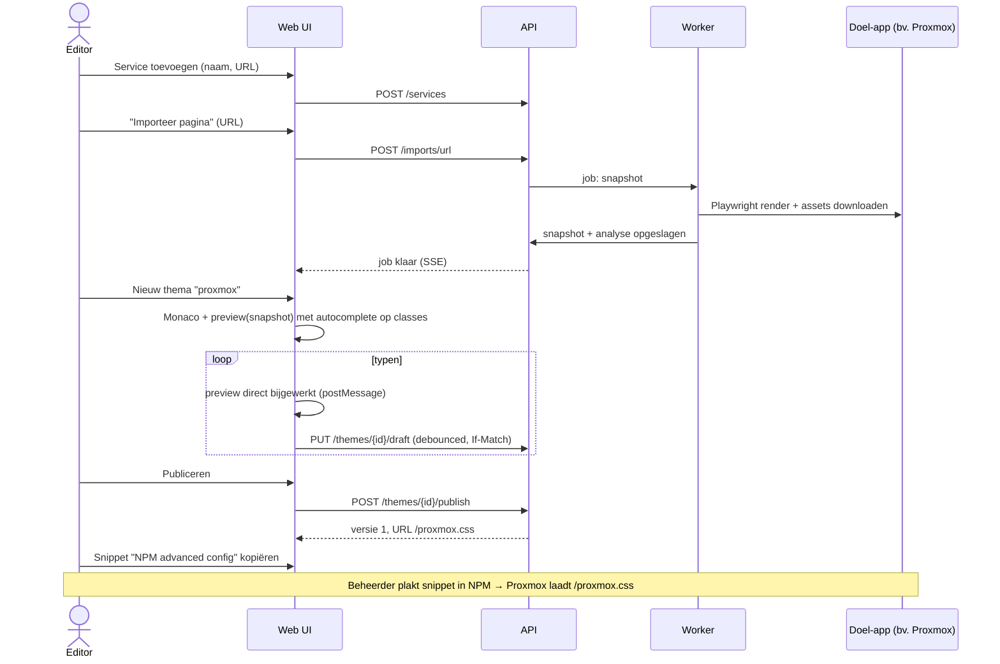

# 01 — Functionele analyse

> Status: **goedgekeurd** · Versie 0.2 · 2026-10-05

## 1. Doel en context

Central CSS Theme Builder (werknaam **cssthema**) is één self-hosted platform waarmee een beheerder custom CSS-thema's beheert voor tientallen webapplicaties die achter Nginx Proxy Manager (NPM) draaien (Proxmox, Nextcloud, Immich, Home Assistant, Grafana, UniFi, Jellyfin, Authentik, Uptime Kuma, Portainer, …).

Het platform heeft drie kerntaken:

1. **Maken**: thema's schrijven in een browser-editor met live preview tegen een echte kopie van de doel-applicatie, met hulp van DOM-analyse en AI.
2. **Beheren**: versies, rollback, import/export, rechten, audit.
3. **Distribueren**: elk thema publiceren op een stabiele URL (`https://cssthema.domain.be/proxmox.css`) die vanuit NPM, browserextensies, userscripts of de app zelf geladen wordt.

### 1.1 Buiten scope (bewust)

| Niet in scope | Reden |
|---|---|
| Wijzigen van bestanden óp de doel-servers (bv. Proxmox `index.html.tpl` patchen) | Breekt bij elke update, vereist shell-toegang tot elke host. Alleen gedocumenteerd als noodoptie. |
| Automatisch NPM-configuratie wegschrijven | NPM-config blijft in handen van de beheerder. cssthema **genereert** snippets en kan in v1.x optioneel via de NPM-API schrijven (achter feature flag). |
| JavaScript-thema's / gedragswijzigingen | Alleen CSS. Uitzondering: gegenereerde userscripts die CSS injecteren in Shadow DOM. |
| Multi-tenant SaaS | Eén installatie = één organisatie/homelab. |

## 2. Actoren en rollen

| Rol | Wie | Rechten (samengevat) |
|---|---|---|
| **Admin** | Eigenaar van het homelab | Alles: gebruikers/rollen, instellingen (NPM, AI-provider), API-keys van anderen, definitief verwijderen, audit log |
| **Editor** | Mede-beheerder, designer | Services en thema's maken/bewerken/publiceren, imports, crawls, AI-generaties, eigen API-keys |
| **Viewer** | Meekijker | Alles lezen, previews bekijken, exporteren |
| **Publiek (anoniem)** | Browsers van eindgebruikers, NPM | Alleen gepubliceerde CSS-endpoints en health checks |
| **Machine (API-key)** | CI, scripts, crawler-cron | Gescoped: bv. `themes:read`, `themes:write`, `discovery:run` |

Volledige permissiematrix: zie [§ 5](#5-rbac-permissiematrix).

## 3. Kernbegrippen (domeinmodel in woorden)

| Begrip | Betekenis |
|---|---|
| **Service** | Een doel-applicatie, bv. "Proxmox op `https://pve.domain.be`". Heeft een type (`proxmox`, `nextcloud`, …, `generic`), URL's, favicon, tags. |
| **DOM-snapshot** | Een vastgelegde momentopname van één pagina van een service (homepage, loginpagina, custom): HTML, stylesheets, classes, IDs, CSS-variabelen, componentboom. Bron: crawler, URL-import of HTML-upload. |
| **Screenshot** | Afbeelding van een pagina op viewport desktop/tablet/mobile, optioneel *met* een thema toegepast (voor/na). |
| **Thema** | Een CSS-thema met een unieke publieke **slug** (`proxmox`, `proxmox-nord`). Hoort optioneel bij een service. Heeft een werkende **draft** en een lijst **versies**. |
| **Draft** | De werkkopie in de editor. Wordt continu automatisch opgeslagen ("live save"), is nooit publiek. |
| **Versie** | Onveranderlijke snapshot van de CSS, aangemaakt bij *publiceren*, *rollback*, *import* of *AI-acceptatie*. Genummerd 1, 2, 3, … |
| **Gepubliceerde versie** | De versie die op `/{slug}.css` geserveerd wordt. |
| **Palet** | Herbruikbare set design tokens (kleuren, radius, font). Ingebouwd: Nord, Dracula, Catppuccin (4 flavours), Gruvbox, Solarized, Material, Cyberpunk, Glassmorphism. Een thema kan een palet koppelen; tokens worden als `--ct-*` variabelen meegecompileerd. Zo krijgen alle apps met één wijziging dezelfde look. |
| **AI-generatie** | Een voorstel (CSS-variabelen + component-overrides + volledige CSS) dat door een AI-model is gemaakt op basis van snapshot + screenshots + stijl-preset. Wordt pas een thema(versie) na acceptatie. |
| **Job** | Asynchrone taak (crawl, screenshot, AI-generatie, discovery) met status en voortgang. |

## 4. Functionele eisen per module

Elke eis heeft een ID (gebruikt in roadmap en tests) en een prioriteit: **M** = MVP, **P** = productie (v1.0), **L** = later.

### 4.1 Theme management (F-TM)

| ID | Eis | Prio |
|---|---|---|
| F-TM-01 | Thema aanmaken: naam, slug (auto uit naam, aanpasbaar, `[a-z0-9-]{2,64}`, uniek, gereserveerde woorden geblokkeerd zoals `api`, `themes`, `assets`, `healthz`), optioneel service, optioneel palet, optioneel startsjabloon (leeg / van AI-generatie / van ander thema). | M |
| F-TM-02 | Thema dupliceren: kopie van draft + metadata met nieuwe slug; versiegeschiedenis wordt **niet** meegekopieerd, nieuwe versie 1 met bron `duplicate`. | M |
| F-TM-03 | Thema verwijderen: soft delete (publieke URL geeft binnen enkele seconden `404`: de api ververst de nginx-cache, zie spike S3), herstelbaar door Admin binnen 30 dagen; daarna purge-job. Hard delete alleen Admin. | M |
| F-TM-04 | Thema exporteren als `.css` (gepubliceerde of specifieke versie) of als bundel `.cssthema.zip` (manifest + draft + alle versies + palet). | M |
| F-TM-05 | Thema importeren uit `.css` of `.cssthema.zip`; bij slug-conflict kiezen: hernoemen / nieuwe versie op bestaand thema / annuleren. | M |
| F-TM-06 | Versiegeschiedenis: lijst met nummer, auteur, tijd, bericht, bron, grootte; side-by-side diff tussen twee willekeurige versies of tussen versie en draft. | M |
| F-TM-07 | Rollback: kies versie N → er ontstaat een **nieuwe** versie (N+k) met de inhoud van N en bron `rollback`, die direct gepubliceerd wordt. Geschiedenis blijft lineair en volledig auditbaar. | M |
| F-TM-08 | Publiceren met optioneel versiebericht. Validatie (zie F-ED-05) moet slagen; waarschuwingen mogen genegeerd worden, fouten niet. | M |
| F-TM-09 | Thema browser: galerij met thumbnails (gethemede screenshot), filter op service/tag/palet/status, zoeken. | M (zonder thumbnails), P (met) |
| F-TM-10 | Selector health check: na een nieuwe crawl van de service controleren welke selectors uit het thema niet meer matchen in de nieuwe DOM (app-update gedetecteerd) en dit tonen. | P |
| F-TM-11 | Gedeelde fragmenten ("partials", bv. scrollbar-styling) die in meerdere thema's ingevoegd worden via `/* @include partial:scrollbars */`. | L |

### 4.2 Live CSS editor (F-ED)

| ID | Eis | Prio |
|---|---|---|
| F-ED-01 | Monaco editor met CSS syntax highlighting, folding, minimap, multi-cursor, find/replace, ingebouwde undo/redo (per sessie, ook over autosaves heen). | M |
| F-ED-02 | Autocomplete: standaard CSS (Monaco CSS language service) **plus** classes, IDs en CSS-variabelen uit de laatste snapshot(s) van de gekoppelde service, gesorteerd op frequentie, plus palet-tokens `--ct-*`. | M |
| F-ED-03 | Linting in de editor: syntaxfouten, onbekende properties, lege regels, dubbele selectors; plus **security-lint** (externe `url()`/`@import` buiten allowlist = fout; zie [09-risicoanalyse](09-risicoanalyse.md) R-03). | M |
| F-ED-04 | Live save: draft wordt 1 s na laatste toetsaanslag automatisch opgeslagen; status-indicator (Opslaan… / Opgeslagen / Conflict / Offline). Bij offline: lokaal bufferen (IndexedDB) en later synchroniseren. | M |
| F-ED-05 | Server-side validatie bij publiceren: parse, security-lint, max. grootte (standaard 512 KB), minify. | M |
| F-ED-06 | Realtime preview naast de editor (side-by-side, splitter versleepbaar, ook boven/onder of losgekoppeld venster). Wijzigingen zijn zichtbaar binnen ~100 ms zonder server-roundtrip. | M |
| F-ED-07 | Preview-bronnen: (a) opgeslagen DOM-snapshot (standaard), (b) live-proxy van de echte app (P), (c) screenshot-overlay voor/na. | a: M, b/c: P |
| F-ED-08 | Viewport-schakelaar in preview: desktop 1920×1080, tablet 820×1180, mobile 390×844, custom. | M |
| F-ED-09 | Element-inspector in preview: klik op element → toont selector-suggesties en voegt een regel in de editor in. | P |
| F-ED-10 | Gelijktijdig bewerken: optimistic locking. Tweede editor krijgt melding "gewijzigd door X", met keuze herladen / overschrijven / diff bekijken. (Geen realtime co-editing in v1.) | M |
| F-ED-11 | File explorer links: boom Services → Thema's → (Draft, Versies), plus Paletten en Snapshots; tabbladen voor meerdere open thema's. | M |

### 4.3 HTML / DOM importer (F-IM)

| ID | Eis | Prio |
|---|---|---|
| F-IM-01 | URL invoeren → backend rendert de pagina in een headless browser (Playwright/Chromium), wacht tot netwerk rustig is, en legt de **gerenderde** DOM vast (niet alleen de ruwe HTML; belangrijk voor SPA's zoals Proxmox/ExtJS, Immich/SvelteKit, Grafana/React). | M |
| F-IM-02 | HTML uploaden (`.html`, `.htm`, `.mhtml`, `.zip` met assets, max. 25 MB). | M |
| F-IM-03 | "Volledige pagina downloaden": alle stylesheets, fonts en afbeeldingen worden opgehaald en lokaal opgeslagen; URL's worden herschreven zodat de snapshot offline en zonder de echte app als preview kan dienen. | M |
| F-IM-04 | DOM-analyse: alle classes (met aantal), IDs, CSS custom properties (gedefinieerd in stylesheets én berekend op `:root`/`body`), gebruikte kleuren (palet-extractie), fonts. | M |
| F-IM-05 | Componentstructuur detecteren: heuristieken voor header, sidebar/navigatie, main content, tabellen, formulieren, knoppen, dialogen, login-formulier; framework-hints (ExtJS, React, Vue, Svelte, Angular, Lit/web components). | M (heuristiek), P (verfijnd per app-type) |
| F-IM-06 | Shadow DOM: open shadow roots worden doorlopen en apart gemarkeerd (Home Assistant, Authentik). Classes binnen shadow roots worden getoond met hun host-element, met de waarschuwing dat globale CSS ze niet bereikt. | M |
| F-IM-07 | Authenticatie voor het ophalen: optioneel cookie-header, Basic Auth of een opgenomen login-script per service (credentials versleuteld opgeslagen). | P |
| F-IM-08 | Resultaat wordt opgeslagen als DOM-snapshot gekoppeld aan een service (bestaand of nieuw aan te maken). | M |

### 4.4 Automatische service discovery (F-SD)

| ID | Eis | Prio |
|---|---|---|
| F-SD-01 | Bron NPM: met NPM-URL + gebruikersnaam/wachtwoord (versleuteld opgeslagen) wordt via de NPM-API (`POST /api/tokens`, `GET /api/nginx/proxy-hosts`) de lijst proxy hosts opgehaald (domeinen, forward host/port, SSL, enabled). | P |
| F-SD-02 | Bron URL-lijst: plakken of uploaden (`.txt`, `.csv`, `.yaml`), één URL per regel, optioneel naam/type. | P (M als CLI-script) |
| F-SD-03 | Per URL: homepage ophalen, redirects volgen, loginpagina detecteren (password-veld, bekende paden zoals `/login`, `/#!/login`, `/auth/`, redirect naar Authentik), favicon ophalen, app-type herkennen (fingerprints op titel, meta, scripts, headers). | P |
| F-SD-04 | Per pagina een DOM-snapshot (F-IM) en screenshots (F-SS) maken. | P |
| F-SD-05 | Resultaat: lijst kandidaten met voorstel (nieuw / bestaat al / gewijzigd). Gebruiker bevestigt welke services aangemaakt of bijgewerkt worden. Nooit stil overschrijven. | P |
| F-SD-06 | Periodiek opnieuw crawlen (cron, standaard wekelijks) voor selector health checks (F-TM-10). | P |
| F-SD-07 | CLI-variant `scripts/discover.py` die dezelfde logica via de API aanroept (API-key), voor cron of CI. | M |
| F-SD-08 | Respecteert concurrency-limiet (standaard 3 parallelle pagina's) en timeouts (30 s per pagina). | P |

### 4.5 Screenshot engine (F-SS)

| ID | Eis | Prio |
|---|---|---|
| F-SS-01 | Playwright (Chromium) in de worker-container. | P |
| F-SS-02 | Per pagina drie viewports: desktop 1920×1080, tablet 820×1180, mobile 390×844 (device scale factor 1, configureerbaar). | P |
| F-SS-03 | Opslaan als WebP (kwaliteit 85) + thumbnail 480 px breed op de object storage; metadata in database. | P |
| F-SS-04 | Gethemede screenshots: zelfde pagina met een themaversie geïnjecteerd (`page.add_style_tag`), voor de thema browser en voor/na-vergelijking. Automatisch na elke publicatie (achtergrondjob). | P |
| F-SS-05 | Retentie: laatste 5 sets per service/pagina; oudere automatisch opgeruimd. | P |

### 4.6 AI theme generation (F-AI)

| ID | Eis | Prio |
|---|---|---|
| F-AI-01 | Invoer: service + snapshot (gecomprimeerde samenvatting: componentboom, top-N classes, IDs, bestaande CSS-variabelen, kleurenpalet) + optioneel screenshots (vision) + stijl-preset + vrije instructie ("donkerder, minder blauw"). | P |
| F-AI-02 | Presets: Cyberpunk, Nord, Dracula, Catppuccin, Gruvbox, Solarized, Material, Glassmorphism, plus "vrij". Elke preset = palet + stijlbeschrijving. | P |
| F-AI-03 | Uitvoer, gestructureerd: `variables` (CSS custom properties), `overrides` (lijst component → selector → declaraties) en `css` (volledige, gecompileerde CSS). | P |
| F-AI-04 | Validatie van de uitvoer: CSS parsebaar, security-lint, en **elke selector wordt gecontroleerd tegen de snapshot**; niet-matchende selectors worden gemarkeerd of verwijderd (tegen gehallucineerde selectors). | P |
| F-AI-05 | Meerdere voorstellen tegelijk (bv. 3 presets parallel) en side-by-side vergelijking met preview. | P |
| F-AI-06 | Accepteren → nieuw thema of nieuwe draft op bestaand thema (bron `ai`). Verwerpen → bewaard voor historie. | P |
| F-AI-07 | Provider-abstractie: Anthropic (standaard), OpenAI-compatibel endpoint (dekt ook vLLM/LM Studio), Ollama (volledig lokaal). Modelnaam configureerbaar. | P |
| F-AI-08 | Deterministische fallback zonder AI: "palette mapping" — bestaande kleuren uit de snapshot worden gemapt op het gekozen palet en als variabele-overrides uitgeschreven. Werkt offline en kost niets. | P |
| F-AI-09 | Kostenbewaking: tokens/kosten per generatie gelogd, maandlimiet configureerbaar. | P |
| F-AI-10 | Iteratief verfijnen: "maak de sidebar donkerder" als vervolg op een generatie, met de huidige CSS als context. | L |

### 4.7 CSS distributie (F-CD)

| ID | Eis | Prio |
|---|---|---|
| F-CD-01 | Publieke endpoints: `/{slug}.css` en `/themes/{slug}.css` (identiek). | M |
| F-CD-02 | Vaste versie: `/themes/{slug}@{n}.css` (onveranderlijk). Cache-busting: `/themes/{slug}.css?v={hash}`. | M |
| F-CD-03 | `Content-Type: text/css; charset=utf-8`, `X-Content-Type-Options: nosniff`. | M |
| F-CD-04 | `ETag` = sterke hash (SHA-256, ingekort) van de gecompileerde CSS; `If-None-Match` → `304`. `Last-Modified` = publicatietijd. | M |
| F-CD-05 | Caching: "latest" → `Cache-Control: public, max-age=60, stale-while-revalidate=600, stale-if-error=86400`; vaste versie → `public, max-age=31536000, immutable`. Configureerbaar. | M |
| F-CD-06 | Nginx-microcache voor CSS-endpoints; bij publicatie, rollback, verwijderen en slug-wijziging ververst de api de cache-entry voor die slug via de interne refresh-server (spike S3). | M |
| F-CD-07 | CORS: `Access-Control-Allow-Origin: *` op CSS (nodig voor `@import`/`fetch` vanuit andere origins en voor userscripts). | M |
| F-CD-08 | Gecomprimeerd (gzip, brotli waar beschikbaar) door Nginx. | M |
| F-CD-09 | Afgeleide formaten: `/themes/{slug}.user.css` (Stylus UserCSS met `@updateURL`, automatische updates in de extensie), `/themes/{slug}.user.js` (Tampermonkey/Violentmonkey userscript dat ook Shadow DOM bereikt), `/themes/{slug}.ha.yaml` (Home Assistant theme met variabelen). | P |
| F-CD-10 | Onbekende of niet-gepubliceerde slug → `404` met lege body `/* not found */` en korte cache (10 s) zodat browsers geen fout tonen maar ook niet lang cachen. | M |
| F-CD-11 | Optioneel per thema "private": alleen bereikbaar met token in query (`?token=`) of vanaf toegestane IP-ranges. | L |

### 4.8 Theme injectie (F-IN)

| ID | Eis | Prio |
|---|---|---|
| F-IN-01 | Documentatie per app (Proxmox, Nextcloud, Immich, Grafana, Home Assistant, UniFi, Authentik, Jellyfin, + Uptime Kuma, Portainer) en per methode (reverse proxy, native, browserextensie, userscript). Zie [10-theme-injectie](10-theme-injectie.md). | M |
| F-IN-02 | Snippet-generator in de UI: per service/thema kant-en-klare snippets (NPM advanced config, Stylus, userscript, native app-instelling), met de juiste domeinen en URL's ingevuld. | M |
| F-IN-03 | Injectie-verificatie: knop "test injectie" laadt de echte app-URL via de worker en controleert of de `<link>` naar cssthema aanwezig is en geladen wordt (geen CSP-blokkade). | P |
| F-IN-04 | Eigen browserextensie (Manifest V3) die per hostname het juiste thema injecteert op basis van `/api/v1/public/injection-map.json`. | L |

### 4.9 Security (F-SE)

| ID | Eis | Prio |
|---|---|---|
| F-SE-01 | Login via Authentik OIDC (authorization code + PKCE). Rollen afgeleid van Authentik-groepen (configureerbaar: `cssthema-admins`, `cssthema-editors`, `cssthema-viewers`). | M |
| F-SE-02 | Break-glass lokaal admin-account (uitgeschakeld tenzij env-variabele gezet), voor als Authentik down is. | M |
| F-SE-03 | RBAC Admin/Editor/Viewer volgens [§ 5](#5-rbac-permissiematrix), afgedwongen in de backend (frontend verbergt alleen). | M |
| F-SE-04 | API-keys: per gebruiker, met naam, scopes, vervaldatum; alleen bij aanmaak éénmalig zichtbaar; gehasht opgeslagen; intrekbaar. | M |
| F-SE-05 | Audit logging van alle schrijfacties, logins, API-key-gebruik en instellingenwijzigingen; filterbaar en exporteerbaar (CSV/JSON). Append-only. | M |
| F-SE-06 | Rate limiting: publieke CSS (per IP, ruim), API (per gebruiker/key), zware acties (crawl, AI) apart en strenger. | M |
| F-SE-07 | SSRF-bescherming voor importer/crawler: configureerbare allowlist van domeinen/CIDR's; cloud-metadata-adressen altijd geblokkeerd. | M |
| F-SE-08 | Geheimen (NPM-wachtwoord, AI-key, service-credentials) versleuteld in de database met een master key uit de omgeving. | M |

### 4.10 Platform (F-PL)

| ID | Eis | Prio |
|---|---|---|
| F-PL-01 | Volledig via `docker compose up -d` te installeren; één `.env`-bestand. | M |
| F-PL-02 | Dashboard op `/`: aantal services/thema's, recent gewijzigd, lopende jobs, selector-health-waarschuwingen, verzoeken op CSS-endpoints (24 u). | M (basis), P (statistieken) |
| F-PL-03 | Backups: dagelijkse `pg_dump` + storage-snapshot, retentie 7 dagelijks / 4 wekelijks / 6 maandelijks; restore-procedure gedocumenteerd en getest. | P |
| F-PL-04 | Health (`/healthz`, `/readyz`) en metrics (`/metrics`, Prometheus). | M / P |
| F-PL-05 | UI in het Engels met i18n-structuur (Nederlands als tweede taal). | M (EN), P (NL) |
| F-PL-06 | Kubernetes-manifests (Kustomize) als alternatief voor compose. | P |

## 5. RBAC-permissiematrix

| Actie | Viewer | Editor | Admin | API-key scope |
|---|:-:|:-:|:-:|---|
| Thema's, services, snapshots, screenshots, versies bekijken | ✓ | ✓ | ✓ | `*:read` |
| Thema exporteren | ✓ | ✓ | ✓ | `themes:read` |
| Thema maken, bewerken (draft), dupliceren, importeren | | ✓ | ✓ | `themes:write` |
| Publiceren, rollback | | ✓ | ✓ | `themes:publish` |
| Thema soft delete | | ✓ (eigen) | ✓ | `themes:write` |
| Thema herstellen / hard delete | | | ✓ | — |
| Service maken/bewerken, URL-import, HTML-upload | | ✓ | ✓ | `services:write` |
| Crawl/discovery starten | | ✓ | ✓ | `discovery:run` |
| AI-generatie starten / accepteren | | ✓ | ✓ | `ai:generate` |
| Paletten beheren | | ✓ | ✓ | `themes:write` |
| Eigen API-keys beheren | ✓ (alleen `*:read`) | ✓ | ✓ | — |
| API-keys van anderen intrekken | | | ✓ | — |
| Gebruikers en rollen | | | ✓ | — |
| Instellingen (NPM, AI, allowlist, retentie) | | | ✓ | — |
| Audit log | | eigen acties | ✓ | `audit:read` (alleen admin-keys) |

Een API-key kan nooit meer rechten hebben dan de rol van de eigenaar op het moment van gebruik (scopes ∩ rol).

## 6. Belangrijkste gebruikersflows

### 6.1 Eerste thema voor een nieuwe app (MVP-flow)

### 6.2 Rollback na een slechte publicatie

1. Versiegeschiedenis openen → versie 4 selecteren → diff met huidige (6) bekijken.
2. "Rollback naar v4" → bevestigen met optioneel bericht.
3. Backend maakt v7 (= inhoud v4, bron `rollback`), publiceert, ververst de nginx-cache, logt audit.
4. Binnen max. 60 s (max-age) laden browsers v7; via NPM-injectie met `?v=`-hash direct.

### 6.3 Discovery via NPM

1. Admin vult eenmalig NPM-URL + credentials in (Instellingen).
2. Editor start "Discovery → NPM". Worker haalt proxy hosts op, filtert uitgeschakelde hosts.
3. Per host: homepage + login, fingerprint, favicon, snapshot, screenshots (concurrency 3).
4. UI toont kandidatenlijst met herkend type en screenshot; gebruiker vinkt aan → services aangemaakt/bijgewerkt.

### 6.4 AI-thema

1. Service openen → "AI Studio" → snapshot kiezen → presets Nord, Dracula, Catppuccin Mocha aanvinken → genereren.
2. Drie jobs parallel; resultaten verschijnen als kaarten met live preview.
3. Per kaart zichtbaar: aantal overrides, gevalideerde/verwijderde selectors, tokens/kosten.
4. "Gebruik als nieuw thema" → editor opent met de CSS als draft.

## 7. Niet-functionele eisen

| ID | Categorie | Eis |
|---|---|---|
| NF-01 | Performance | Publieke CSS: p95 < 20 ms vanuit Nginx-cache, > 2.000 req/s op 1 vCPU. API: p95 < 200 ms voor CRUD. Preview-update < 100 ms. |
| NF-02 | Beschikbaarheid | Uitval van cssthema mag de doel-apps nooit breken: zij vallen terug op hun standaard-look. Gecachede CSS blijft 24 u geserveerd bij backend-uitval (`stale-if-error` + Nginx `proxy_cache_use_stale`). |
| NF-03 | Schaal | Ontworpen voor 10–500 services, 10–2.000 thema's, 100.000 versies, 1–25 gelijktijdige gebruikers. API en worker horizontaal schaalbaar. |
| NF-04 | Opslag | Snapshot-HTML en screenshots niet in de database maar in object storage (filesystem of S3-compatibel). |
| NF-05 | Security | OWASP ASVS niveau 2 als leidraad. Geen geheimen in logs. Alle externe input gevalideerd (Pydantic). |
| NF-06 | Onderhoudbaarheid | Backend test coverage ≥ 80 %, typed (mypy strict), frontend strict TypeScript, CI op elke PR. |
| NF-07 | Portabiliteit | Images multi-arch (amd64 + arm64, voor Raspberry Pi/ARM-NAS). |
| NF-08 | Observability | Gestructureerde JSON-logs met request-ID, Prometheus-metrics, optioneel OpenTelemetry traces. |
| NF-09 | Toegankelijkheid | WCAG 2.1 AA voor de eigen UI (contrast, toetsenbordnavigatie). |
| NF-10 | Upgradebaarheid | Database-migraties via Alembic draaien automatisch bij start (met lock), zero-downtime voor minor releases. |

## 8. Aannames

1. cssthema zelf draait ook achter NPM, dat TLS termineert (`cssthema.domain.be`).
2. Authentik is beschikbaar als OIDC-provider; zonder Authentik werkt alleen het break-glass account (bedoeld voor installatie en noodgevallen).
3. De worker kan de doel-apps over het interne netwerk bereiken (dezelfde Docker-host of LAN).
4. Thema's zijn niet geheim: wie de CSS-URL kent, kan hem lezen (zoals bij elke publieke stylesheet). Zie F-CD-11 voor de latere private optie.
5. Eén actieve AI-provider tegelijk volstaat.
