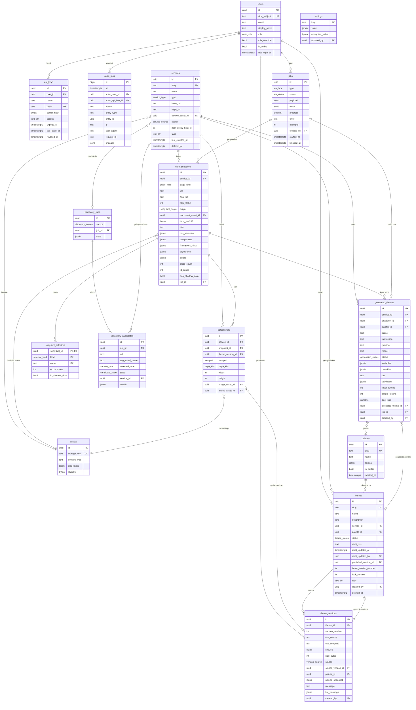

# 03 — Database-ontwerp

> Status: **goedgekeurd** · Versie 0.2 · 2026-10-05
> PostgreSQL 16 · SQLAlchemy 2.0 (async, `Mapped[]`-stijl) · Alembic

## 1. Conventies

| Conventie | Keuze |
|---|---|
| Primaire sleutels | `UUID` (v7, tijd-sorteerbaar, gegenereerd in de applicatie). Uitzondering: `audit_logs.id` is `BIGINT IDENTITY` (hoog volume, alleen intern). |
| Tijden | `TIMESTAMPTZ`, altijd UTC. Elke tabel `created_at`; muteerbare tabellen ook `updated_at` (via SQLAlchemy `onupdate`). |
| Soft delete | `deleted_at TIMESTAMPTZ NULL` op `services`, `themes`, `palettes`. Unieke indexen zijn *partial* (`WHERE deleted_at IS NULL`). |
| Enums | PostgreSQL native enums via `sqlalchemy.Enum(..., name=...)`; nieuwe waarden via Alembic `ALTER TYPE … ADD VALUE`. |
| JSON | `JSONB` voor analyse-resultaten en flexibele metadata; nooit voor iets waar we op joinen. |
| Naamgeving | `snake_case`, tabellen meervoud, FK's `<entiteit>_id`, constraint-namen via `MetaData(naming_convention=…)` zodat Alembic autogenerate stabiel is. |
| Optimistic locking | `themes.lock_version INT` (SQLAlchemy `version_id_col`) — basis voor ETag/If-Match op de draft. |
| Grote blobs | Niet in de DB; `assets`-tabel verwijst naar object storage. |

## 2. ER-diagram



## 3. Enums

| Enum | Waarden |
|---|---|
| `user_role` | `admin`, `editor`, `viewer` |
| `service_type` | `generic`, `proxmox`, `nextcloud`, `immich`, `home_assistant`, `grafana`, `unifi`, `jellyfin`, `authentik`, `uptime_kuma`, `portainer` (uitbreidbaar) |
| `service_source` | `manual`, `npm`, `url_list`, `import` |
| `page_kind` | `home`, `login`, `custom` |
| `snapshot_origin` | `crawler`, `url_import`, `upload` |
| `selector_kind` | `class`, `id`, `css_variable`, `element`, `attribute` |
| `viewport` | `desktop`, `tablet`, `mobile` |
| `theme_status` | `draft` (nooit gepubliceerd), `published`, `archived` |
| `version_source` | `manual`, `rollback`, `import`, `duplicate`, `ai` |
| `generation_status` | `pending`, `running`, `ready`, `failed`, `accepted`, `rejected` |
| `job_type` | `snapshot_capture`, `snapshot_analyze`, `screenshot_capture`, `discovery_npm`, `discovery_urls`, `ai_generate`, `theme_health_check`, `export_bundle`, `maintenance` |
| `job_status` | `queued`, `running`, `succeeded`, `failed`, `cancelled` |
| `discovery_source` | `npm`, `url_list` |
| `candidate_state` | `new`, `existing_unchanged`, `existing_changed`, `unreachable`, `accepted`, `ignored` |

## 4. Tabellen in detail

Alleen niet-vanzelfsprekende kolommen en constraints; `id`, `created_at`, `updated_at` zijn overal aanwezig zoals in § 1.

### 4.1 `users`
- `oidc_subject` uniek (Authentik `sub`); voor het break-glass account de vaste waarde `local:admin`.
- `role_override`: als `true` wordt de rol niet bij login overschreven door de groups-claim.
- Gebruikers worden nooit verwijderd (audit-integriteit), alleen `is_active = false`.

### 4.2 `api_keys`
- `prefix` (8 tekens) uniek en geïndexeerd voor lookup; `secret_hash = sha256(secret)`.
- `scopes TEXT[]` met CHECK op toegestane waarden.
- Index `(user_id) WHERE revoked_at IS NULL`.
- `last_used_at` wordt maximaal 1× per minuut geüpdatet (via Redis-debounce) om schrijfdruk te beperken.

### 4.3 `services`
- `slug` uniek (partial, niet-verwijderd); gebruikt in de UI-URL's, niet in de publieke CSS-URL (dat is de thema-slug).
- `base_url` uniek (partial) → discovery herkent bestaande services.
- `npm_proxy_host_id`: ID in NPM, voor her-synchronisatie.
- Index GIN op `tags`.

### 4.4 `dom_snapshots`
- `document_asset_id` → gegzipte HTML in storage (kan MB's zijn).
- `components` JSONB: boom `[{type:"sidebar", selector:".x-panel-west", confidence:0.8, children:[…]}]`.
- `css_variables` JSONB: `{ "--pve-bg": {"value": "#fff", "defined_in": ":root", "count": 12} }`.
- `colors` JSONB: top-24 kleuren met gebruik (`{"#3c4043": {"count": 312, "properties": ["color","border-color"]}}`) — input voor palette mapping.
- Index `(service_id, page_kind, created_at DESC)` → "laatste snapshot per pagina" in O(log n).

### 4.5 `snapshot_selectors`
Genormaliseerde uitsplitsing van classes/IDs/variabelen voor snelle autocomplete en health checks.
- PK `(snapshot_id, kind, name)`.
- Index GIN `name gin_trgm_ops` (extensie `pg_trgm`) → `ILIKE '%panel%'` snel.
- Volume: ± 500–5.000 rijen per snapshot; met retentie (5 per pagina) blijft dit < 5 M rijen bij 500 services.

### 4.6 `screenshots`
- `theme_version_id NULL` = origineel; gevuld = gethemede versie (voor/na).
- Unieke index niet nodig; retentie-job houdt de laatste 5 sets per `(service_id, page_kind, viewport, theme_version_id IS NULL)`.

### 4.7 `assets`
- Content-addressed: `sha256` uniek → dezelfde font of afbeelding wordt één keer opgeslagen, ook al komt hij in 50 snapshots voor.
- Referentietelling niet in de DB; de retentie-job doet mark-and-sweep (assets zonder verwijzing ouder dan 7 dagen worden verwijderd).

### 4.8 `palettes`
- `tokens` JSONB, gevalideerd door een Pydantic-schema: `{ "bg": "#2e3440", "surface": "#3b4252", "fg": "#eceff4", "muted": …, "accent": …, "accent-fg": …, "success": …, "warning": …, "danger": …, "border": …, "radius": "6px", "font-sans": "Inter, sans-serif", "font-mono": … }`. Gecompileerd als `--ct-<naam>`.
- Ingebouwde paletten (`is_builtin = true`) worden via een data-migratie geseed en zijn niet bewerkbaar (wel dupliceerbaar).

### 4.9 `themes`
- `slug` uniek (partial) en CHECK `slug ~ '^[a-z0-9][a-z0-9-]{0,62}[a-z0-9]$'`; gereserveerde slugs worden in de applicatie geweigerd.
- `published_version_id` FK naar `theme_versions` (`use_alter=True`, circulaire FK) — de bron voor publieke levering.
- `latest_version_number` om het volgende versienummer zonder `MAX()`-query en race-vrij te bepalen (`UPDATE … SET latest_version_number = latest_version_number + 1 RETURNING`).
- `lock_version` voor optimistic locking op de draft (`If-Match`).
- Verwijderen van een service → `themes.service_id ON DELETE SET NULL` (thema blijft bestaan).

### 4.10 `theme_versions`
- Onveranderlijk: geen `updated_at`; een database-trigger weigert `UPDATE` (behalve technische migraties) — bescherming tegen bugs.
- UNIQUE `(theme_id, version_number)`.
- `palette_snapshot` JSONB: kopie van de palet-tokens op het moment van publiceren → een latere paletwijziging verandert een oude versie niet. (Wijziging van een palet biedt in de UI "herpubliceer alle gekoppelde thema's" aan, wat nieuwe versies maakt.)
- `source_version_id`: bij rollback de versie waarvan gekopieerd is.
- `sha256` → ETag.

### 4.11 `generated_themes`
- Bewaart volledige in- en uitvoer-metadata voor reproduceerbaarheid en kostenrapportage; de prompt zelf niet (alleen een hash), om opslag te beperken.
- `validation` JSONB: `{ "matched": 84, "unmatched": [".foo-bar", …], "lint": […] }`.

### 4.12 `jobs`
- Index `(status, created_at)` en `(created_by, created_at DESC)`.
- Retentie: geslaagde jobs na 30 dagen verwijderd, mislukte na 90.

### 4.13 `audit_logs`
- Append-only: een trigger weigert `UPDATE` en `DELETE` (werkt ook als de applicatie als eigenaar van de tabel verbindt, waar grants niet helpen). Alleen een migratie kan dit tijdelijk opheffen met `SET LOCAL cssthema.allow_mutation = 'on'` (bv. voor retentie).
- `action` als `<entity>.<werkwoord>`: `theme.create`, `theme.publish`, `theme.rollback`, `apikey.create`, `auth.login`, `settings.update`, …
- `changes` JSONB: `{ "field": [oud, nieuw] }` — nooit geheimen of volledige CSS (alleen hashes/lengtes).
- Partitionering per maand (declaratieve range partitioning op `at`) vanaf productiefase; retentie standaard 2 jaar.

### 4.14 `settings`
- Sleutel/waarde voor runtime-instellingen die de Admin in de UI beheert: `npm.connection`, `ai.provider`, `fetch.allowlist`, `css.url_allowlist`, `retention.*`.
- Geheimen in `encrypted_value` (Fernet met `ENCRYPTION_KEY`), nooit in `value`.

## 5. Indexoverzicht

| Tabel | Index | Doel |
|---|---|---|
| `themes` | `UNIQUE (slug) WHERE deleted_at IS NULL` | Publieke lookup `/slug.css` |
| `themes` | `(service_id) WHERE deleted_at IS NULL` | File explorer |
| `theme_versions` | `UNIQUE (theme_id, version_number)` | Historie, `@n`-URL's |
| `dom_snapshots` | `(service_id, page_kind, created_at DESC)` | Laatste snapshot |
| `snapshot_selectors` | GIN trigram op `name` | Autocomplete |
| `screenshots` | `(service_id, page_kind, viewport, created_at DESC)` | Thumbnails |
| `assets` | `UNIQUE (sha256)` | Deduplicatie |
| `api_keys` | `UNIQUE (prefix)` | Auth lookup |
| `jobs` | `(status, created_at)` | Queue-overzicht |
| `audit_logs` | `(at DESC)`, `(entity_type, entity_id, at DESC)`, `(actor_user_id, at DESC)` | Filters |

## 6. SQLAlchemy-modellen (ontwerp-excerpt)

Ter illustratie van stijl en kernrelaties; de volledige modellen worden in de implementatiefase geschreven in `backend/src/cssthema/db/models/`.

```python
class Theme(Base, TimestampMixin, SoftDeleteMixin):
    __tablename__ = "themes"
    __table_args__ = (
        Index("uq_themes_slug_active", "slug", unique=True,
              postgresql_where=text("deleted_at IS NULL")),
        CheckConstraint(r"slug ~ '^[a-z0-9][a-z0-9-]{0,62}[a-z0-9]$'", name="slug_format"),
    )

    id: Mapped[UUID] = mapped_column(primary_key=True, default=uuid7)
    slug: Mapped[str] = mapped_column(String(64))
    name: Mapped[str] = mapped_column(String(120))
    description: Mapped[str | None]
    service_id: Mapped[UUID | None] = mapped_column(ForeignKey("services.id", ondelete="SET NULL"))
    palette_id: Mapped[UUID | None] = mapped_column(ForeignKey("palettes.id", ondelete="SET NULL"))
    status: Mapped[ThemeStatus] = mapped_column(default=ThemeStatus.DRAFT)
    draft_css: Mapped[str] = mapped_column(Text, default="")
    draft_updated_at: Mapped[datetime | None]
    draft_updated_by: Mapped[UUID | None] = mapped_column(ForeignKey("users.id"))
    published_version_id: Mapped[UUID | None] = mapped_column(
        ForeignKey("theme_versions.id", use_alter=True, name="fk_themes_published_version"))
    latest_version_number: Mapped[int] = mapped_column(default=0)
    lock_version: Mapped[int] = mapped_column(default=1)
    tags: Mapped[list[str]] = mapped_column(ARRAY(String(40)), default=list)
    created_by: Mapped[UUID] = mapped_column(ForeignKey("users.id"))

    service: Mapped["Service | None"] = relationship(back_populates="themes")
    palette: Mapped["Palette | None"] = relationship()
    versions: Mapped[list["ThemeVersion"]] = relationship(
        back_populates="theme", foreign_keys="ThemeVersion.theme_id",
        order_by="ThemeVersion.version_number.desc()", lazy="raise",
        passive_deletes=True)  # DB-cascade; een ORM-UPDATE van versies weigert de trigger
    published_version: Mapped["ThemeVersion | None"] = relationship(
        foreign_keys=[published_version_id], post_update=True)

    __mapper_args__ = {"version_id_col": lock_version}


class ThemeVersion(Base):
    __tablename__ = "theme_versions"
    __table_args__ = (UniqueConstraint("theme_id", "version_number"),)

    id: Mapped[UUID] = mapped_column(primary_key=True, default=uuid7)
    theme_id: Mapped[UUID] = mapped_column(ForeignKey("themes.id", ondelete="CASCADE"))
    version_number: Mapped[int]
    css_source: Mapped[str] = mapped_column(Text)
    css_compiled: Mapped[str] = mapped_column(Text)
    sha256: Mapped[bytes] = mapped_column(LargeBinary(32))
    size_bytes: Mapped[int]
    source: Mapped[VersionSource]
    # Geen ON DELETE SET NULL op deze twee FK's: dat is een UPDATE, en versies zijn onveranderlijk.
    source_version_id: Mapped[UUID | None] = mapped_column(ForeignKey("theme_versions.id"))
    palette_id: Mapped[UUID | None] = mapped_column(ForeignKey("palettes.id"))
    palette_snapshot: Mapped[dict | None] = mapped_column(JSONB)
    message: Mapped[str | None] = mapped_column(String(500))
    lint_warnings: Mapped[list[dict]] = mapped_column(JSONB, default=list)
    created_by: Mapped[UUID] = mapped_column(ForeignKey("users.id"))
    created_at: Mapped[datetime] = mapped_column(server_default=func.now())

    theme: Mapped[Theme] = relationship(back_populates="versions", foreign_keys=[theme_id])
```

`lazy="raise"` op collecties dwingt expliciete `selectinload` af → geen verborgen N+1-queries in async code.

## 7. Kernqueries

**Publieke CSS (hot path, daarna gecachet in Redis/nginx):**
```sql
SELECT v.version_number, v.css_compiled, v.sha256, v.created_at
FROM themes t
JOIN theme_versions v ON v.id = t.published_version_id
WHERE t.slug = $1 AND t.deleted_at IS NULL;
```

**Publiceren (één transactie):**
```sql
UPDATE themes SET latest_version_number = latest_version_number + 1, lock_version = lock_version + 1
 WHERE id = $1 AND lock_version = $2 RETURNING latest_version_number;   -- 0 rijen → 412
INSERT INTO theme_versions (…) VALUES (…);
UPDATE themes SET published_version_id = $new, status = 'published' WHERE id = $1;
INSERT INTO audit_logs (…);
-- na commit: Redis DEL css:{slug}, refresh via nginx:8081 (spike S3), enqueue screenshot.capture (gethemed)
-- dezelfde refresh na rollback, soft delete, herstel, hard delete en slug-wijziging (oude én nieuwe slug)
```

## 8. Migratiestrategie

- Alembic met `naming_convention`, autogenerate als startpunt, altijd handmatig gereviewd.
- Eerste migratie `0001_initial` maakt de extensie `pg_trgm`, enums, tabellen en de triggers die `theme_versions` onveranderlijk en `audit_logs` append-only maken.
- Data-migratie `0002_seed_palettes` voor de ingebouwde paletten.
- Regels: elke migratie heeft een werkende `downgrade()`; destructieve wijzigingen in twee releases (expand → contract); `CREATE INDEX CONCURRENTLY` voor indexen op grote tabellen.
- CI draait `alembic upgrade head && alembic downgrade base && alembic upgrade head` op een lege DB, plus een check dat autogenerate geen verschil meer vindt.

## 9. Volume-inschatting (500 services, 2 jaar)

| Tabel | Rijen | Grootte |
|---|---|---|
| `themes` | 2.000 | < 50 MB (incl. drafts) |
| `theme_versions` | 100.000 | ± 2 GB (bron + gecompileerd, ~10 KB per versie) |
| `dom_snapshots` | 5.000 (met retentie) | < 100 MB (HTML in storage) |
| `snapshot_selectors` | 5 M | ± 600 MB |
| `audit_logs` | 1–2 M | ± 1 GB |
| Storage (HTML, assets, screenshots) | — | 20–50 GB |

Ruim binnen wat één PostgreSQL-instantie op een homelab-server aankan.
