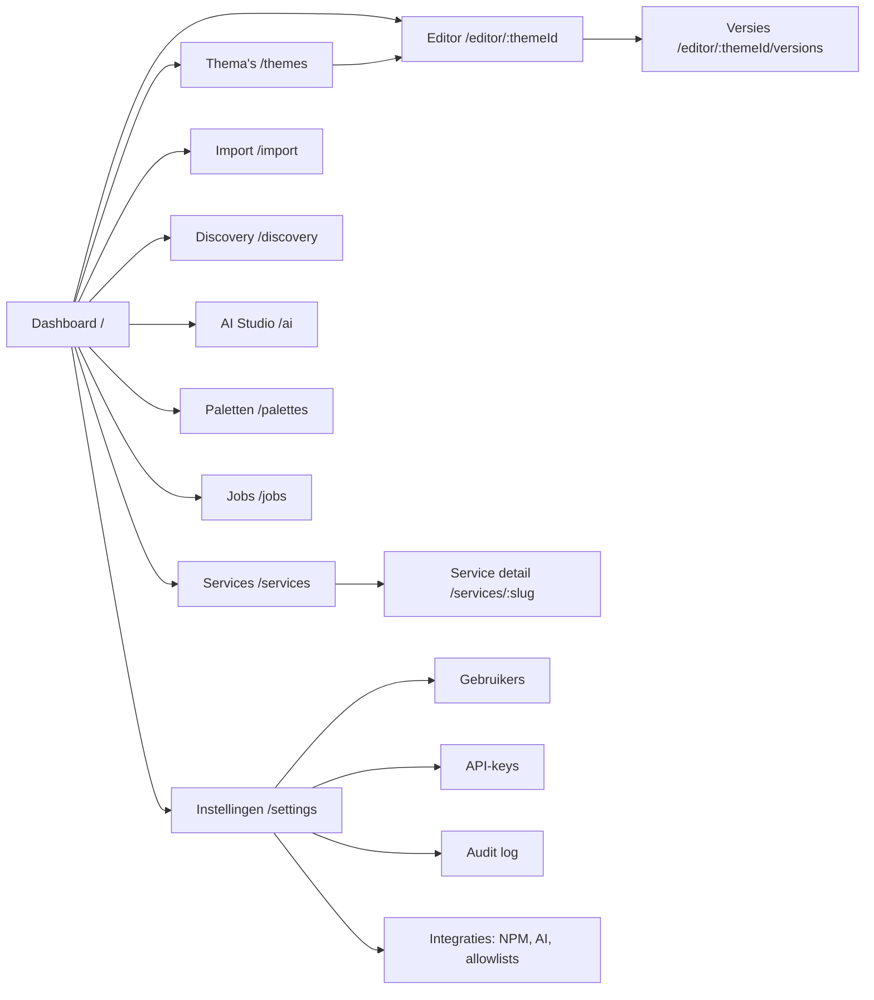

# 04 — UI-wireframes

> Status: **goedgekeurd** · Versie 0.2 · 2026-10-05

## 1. Ontwerpprincipes

- **Dark-first**, rustig: neutrale grijzen (`zinc-950` achtergrond, `zinc-900` panelen), één accentkleur (violet `#8b5cf6`), status-kleuren alleen voor status. Light mode beschikbaar.
- **Editor-centraal**: de editorpagina is een IDE-achtige werkruimte (VS Code-gevoel); de rest van de app is klassieke beheer-UI.
- **Toetsenbord eerst**: `Ctrl/⌘+K` command palette (ga naar thema/service, acties), `Ctrl+S` publiceren-dialoog, `Ctrl+P` snel thema openen, `Ctrl+\` preview tonen/verbergen.
- **Altijd zichtbaar wat live is**: overal een badge `v7 live` / `draft gewijzigd` / `nooit gepubliceerd`.
- Componenten: shadcn/ui (Radix), dus toegankelijk (focus, ARIA) zonder extra werk.

## 2. Navigatiestructuur



Let op: de SPA leeft op `/` maar alle routes hebben géén `.css`-extensie, dus er is geen conflict met `/{slug}.css`.

## 3. Wireframes

### 3.1 App-shell en Dashboard

```
┌──────────────────────────────────────────────────────────────────────────────────────┐
│ ◆ cssthema        [ Zoek of typ een commando…            ⌘K ]        ⟳ 2 jobs   (JB) ▾ │
├────────────┬─────────────────────────────────────────────────────────────────────────┤
│ ▣ Dashboard│  Dashboard                                                              │
│ ▤ Services │                                                                         │
│ ✎ Thema's  │  ┌─────────────┐ ┌─────────────┐ ┌─────────────┐ ┌──────────────────┐  │
│ ⇩ Import   │  │ Services    │ │ Thema's     │ │ Gepubliceerd│ │ CSS-requests 24u │  │
│ ⌕ Discovery│  │     34      │ │     41      │ │     29      │ │  18.302  ▁▂▅▇▅▃ │  │
│ ✦ AI Studio│  └─────────────┘ └─────────────┘ └─────────────┘ └──────────────────┘  │
│ ◐ Paletten │                                                                         │
│ ⚙ Jobs     │  ⚠ Aandacht nodig                                                       │
│            │  ┌───────────────────────────────────────────────────────────────────┐  │
│            │  │ ⚠ proxmox      12 selectors matchen niet meer na crawl van 3 okt  │  │
│            │  │ ⚠ immich       service onbereikbaar bij laatste crawl             │  │
│            │  └───────────────────────────────────────────────────────────────────┘  │
│            │                                                                         │
│            │  Recent gewijzigd                          Lopende jobs                 │
│            │  ┌──────────────────────────────────┐     ┌──────────────────────────┐ │
│            │  │ [img] nextcloud   v12  2 min  JB │     │ AI · grafana · Nord ▓▓▓░ │ │
│            │  │ [img] grafana     draft 1 u  JB  │     │ Crawl · npm   18/34 ▓▓░░ │ │
│            │  │ [img] jellyfin    v4   gisteren  │     └──────────────────────────┘ │
│            │  └──────────────────────────────────┘                                  │
│ ─────────  │                                                                         │
│ ⚙ Instell. │                                                                         │
└────────────┴─────────────────────────────────────────────────────────────────────────┘
```

### 3.2 Theme Editor (kernscherm)

```
┌──────────────────────────────────────────────────────────────────────────────────────────────┐
│ ◆  proxmox ▸ proxmox-nord     ● draft gewijzigd · v7 live      [Diff] [Versies] [⤓] [Publiceer]│
├───────────────┬──────────────────────────────────────┬───────────────────────────────────────┤
│ EXPLORER      │ proxmox-nord.css ×  nextcloud.css ×  │ PREVIEW  [Snapshot: login ▾] [▭ ▯ ▯]  │
│ ⌕ filter      │──────────────────────────────────────│          desktop tablet mobile         │
│ ▾ ▤ Proxmox   │  1  /* Proxmox — Nord */             │          [◐ voor/na] [⌖ inspector]    │
│   ▾ ✎ proxmox │  2  :root {                          │ ┌───────────────────────────────────┐ │
│     ● draft   │  3    --pve-bg: var(--ct-bg);        │ │ ▓▓▓ Proxmox VE  ▓▓▓▓▓▓▓▓▓▓▓▓▓▓▓▓ │ │
│     ▸ versies │  4  }                                │ │ ┌──────┐ ┌──────────────────────┐ │ │
│   ▾ ✎ proxmox-│  5                                   │ │ │ Data │ │ Summary              │ │ │
│       nord    │  6  .x-panel-header {                │ │ │ ├pve1│ │  CPU  ▓▓▓▓░░  32%    │ │ │
│ ▸ ▤ Nextcloud │  7    background: var(--ct-surf│     │ │ │ └pve2│ │  RAM  ▓▓▓▓▓░  61%    │ │ │
│ ▸ ▤ Grafana   │     ┌──────────────────────────────┐ │ │ └──────┘ └──────────────────────┘ │ │
│ ▸ ▤ Jellyfin  │     │ --ct-surface   #3b4252  palet│ │ │                                   │ │
│ ───────────── │     │ --ct-surface-2 #434c5e  palet│ │ │                                   │ │
│ ▾ ◐ Paletten  │     │ --pve-panel-bg  (snapshot)   │ │ │                                   │ │
│   Nord        │     └──────────────────────────────┘ │ └───────────────────────────────────┘ │
│ ▾ ⧉ Snapshots │  8  }                                │ Geselecteerd: div.x-panel-header       │
│   login 3 okt │                                      │   ↳ [Voeg regel toe]                   │
│   home  3 okt │                                      │                                       │
├───────────────┴──────────────────────────────────────┴───────────────────────────────────────┤
│ ✓ Opgeslagen 12:04:31 │ 2 waarschuwingen ⚠ │ 0 fouten │ 3,4 KB │ Ln 7, Col 32 │ CSS │ Nord   │
└──────────────────────────────────────────────────────────────────────────────────────────────┘
```

Gedrag:
- Drie panelen met versleepbare splitters; preview kan los (popout-venster) of onder de editor.
- Autocomplete-popup toont bron (palet / snapshot / CSS) en voorbeeldkleur.
- Inspector-modus: hover in preview tekent outline; klik toont selector-kandidaten (kortste unieke, op class, op structuur) → "Voeg regel toe" plaatst `selector { }` met cursor erin.
- Probleempaneel (klik op "2 waarschuwingen"): lijst met lint-meldingen, klikbaar naar regel.
- Statusbalk: autosave-status, lint, grootte, cursor, gekoppeld palet.

### 3.3 Publiceer-dialoog

```
┌──────────────────────────────────────────────────┐
│ Publiceer proxmox-nord                        ×  │
├──────────────────────────────────────────────────┤
│ Nieuwe versie: v8                                │
│ Wijzigingen t.o.v. v7:  +14  −3 regels  [diff ▸] │
│                                                  │
│ Bericht (optioneel)                              │
│ ┌──────────────────────────────────────────────┐ │
│ │ Sidebar donkerder, login-knop accent          │ │
│ └──────────────────────────────────────────────┘ │
│                                                  │
│ Validatie                                        │
│ ✓ CSS parsebaar                                  │
│ ✓ Geen externe URL's buiten allowlist           │
│ ⚠ 2 selectors matchen niet in laatste snapshot  │
│                                                  │
│ Live op: https://cssthema.domain.be/proxmox-nord.css
│                                                  │
│                     [Annuleren]  [Publiceer v8]  │
└──────────────────────────────────────────────────┘
```

### 3.4 Versiegeschiedenis en diff

```
┌──────────────────────────────────────────────────────────────────────────────────────┐
│ ← proxmox-nord · Versies                                       [Vergelijk geselect.] │
├──────────────────────────────┬───────────────────────────────────────────────────────┤
│ ○ draft    gewijzigd 2 min   │  v6  ⟷  v7                         [Side-by-side|Inline]│
│ ● v7 LIVE  JB  vandaag 11:58 │ ┌─────────────────────────┬─────────────────────────┐ │
│   "Sidebar donkerder"  manual│ │ 6 .x-panel-header {     │ 6 .x-panel-header {     │ │
│ ○ v6       JB  2 okt         │ │ 7-  background: #3b4252;│ 7+  background: var(--ct│ │
│   rollback van v4  ↺         │ │ 8 }                     │ 8 }                     │ │
│ ○ v5       AI  1 okt  ✦ Nord │ └─────────────────────────┴─────────────────────────┘ │
│ ○ v4       JB  30 sep        │                                                       │
│ …                            │ [⤓ Download v6] [Open in editor] [↺ Rollback naar v6] │
└──────────────────────────────┴───────────────────────────────────────────────────────┘
```

### 3.5 Thema browser

```
┌──────────────────────────────────────────────────────────────────────────────────────┐
│ Thema's                [⌕ zoeken      ] [Service ▾] [Palet ▾] [Status ▾] [+ Nieuw ▾]│
│                                                         (leeg · importeren · AI)    │
├──────────────────────────────────────────────────────────────────────────────────────┤
│ ┌───────────────┐ ┌───────────────┐ ┌───────────────┐ ┌───────────────┐              │
│ │ [screenshot   │ │ [screenshot   │ │ [screenshot   │ │ [screenshot   │              │
│ │  gethemed]    │ │  gethemed]    │ │  gethemed]    │ │  geen]        │              │
│ │ proxmox-nord  │ │ nextcloud     │ │ grafana       │ │ jellyfin-test │              │
│ │ ▤ Proxmox     │ │ ▤ Nextcloud   │ │ ▤ Grafana     │ │ ▤ Jellyfin    │              │
│ │ v7 live · Nord│ │ v12 live      │ │ draft         │ │ archived      │              │
│ │ ⚠ 12 selectors│ │               │ │               │ │               │              │
│ │ [Open] [⋯]    │ │ [Open] [⋯]    │ │ [Open] [⋯]    │ │ [Open] [⋯]    │              │
│ └───────────────┘ └───────────────┘ └───────────────┘ └───────────────┘              │
│  ⋯ = Dupliceren · Exporteren · Injectie-snippets · Kopieer URL · Archiveren · Verw.  │
└──────────────────────────────────────────────────────────────────────────────────────┘
```

### 3.6 Service detail

```
┌──────────────────────────────────────────────────────────────────────────────────────┐
│ [fav] Proxmox VE    https://pve.domain.be   type: proxmox  bron: NPM #12             │
│ [Crawl nu] [Importeer pagina] [Nieuw thema] [✦ AI-thema]                       [⋯]   │
├──────────────────────────────────────────────────────────────────────────────────────┤
│ Tabs:  Overzicht | Snapshots | Screenshots | Selectors | Thema's | Injectie          │
├──────────────────────────────────────────────────────────────────────────────────────┤
│ Screenshots (laatste crawl 3 okt)       [Origineel | Met proxmox-nord v7]            │
│ ┌───────────────────────┐ ┌─────────────┐ ┌──────┐                                   │
│ │ desktop               │ │ tablet      │ │mobile│                                   │
│ └───────────────────────┘ └─────────────┘ └──────┘                                   │
│                                                                                      │
│ Detectie                                                                             │
│  Framework: ExtJS 7 · Shadow DOM: nee · Login: /  (realm-formulier)                 │
│  Componenten: header ✓ sidebar/tree ✓ grid ✓ form ✓ dialog ✓                        │
│  Classes: 1.284 · IDs: 312 · CSS-variabelen: 0                                       │
│  Aanbevolen injectie: reverse proxy (sub_filter)                                     │
└──────────────────────────────────────────────────────────────────────────────────────┘
```

Tab **Injectie**: kies thema + methode → kant-en-klaar snippet met kopieerknop en knop "Test injectie".

```
│ Thema: [proxmox-nord ▾]   Methode: (•) NPM sub_filter ( ) Stylus ( ) Userscript ( ) Native │
│ ┌──────────────────────────────────────────────────────────────────────────────────┐  │
│ │ # NPM → Proxy Host pve.domain.be → Advanced                                     │  │
│ │ location /__cssthema/ { proxy_pass https://cssthema.domain.be/themes/; … }     │  │
│ │ …                                                                       [Kopieer]│  │
│ └──────────────────────────────────────────────────────────────────────────────────┘  │
│ [▶ Test injectie]   ✓ <link> gevonden · ✓ CSS geladen (200, v7) · ✓ geen CSP-blokkade │
```

### 3.7 Import (URL / upload)

```
┌──────────────────────────────────────────────────────────────────────────────────────┐
│ Pagina importeren                                                                    │
├──────────────────────────────────────────────────────────────────────────────────────┤
│ ( • ) URL      [ https://grafana.domain.be/login                         ]           │
│ (   ) Upload   [ Sleep .html / .mhtml / .zip hierheen ]                              │
│                                                                                      │
│ Service      [ Grafana ▾ ]  of  [+ nieuwe service]                                   │
│ Paginatype   ( ) Home  (•) Login  ( ) Custom                                         │
│ Opties       [✓] Volledige pagina downloaden (assets)  [✓] Screenshots maken          │
│              [ ] Authenticatie gebruiken (service-credentials)                       │
│                                                                    [Importeren]      │
├──────────────────────────────────────────────────────────────────────────────────────┤
│ Resultaat                                                                            │
│ ✓ Gerenderd (2,1 s) ✓ 38 stylesheets ✓ 214 assets ✓ Analyse                          │
│ Classes 902 · IDs 41 · Variabelen 186 · Framework: React · Shadow DOM: nee            │
│ [Bekijk snapshot]  [Nieuw thema op basis hiervan]  [✦ AI-thema]                       │
└──────────────────────────────────────────────────────────────────────────────────────┘
```

### 3.8 Discovery-wizard

```
 Stap 1 Bron          Stap 2 Scannen              Stap 3 Kandidaten              Stap 4 Klaar
 ───────────          ──────────────              ─────────────────              ────────────
┌──────────────────────────────────────────────────────────────────────────────────────┐
│ Kandidaten (34 gevonden, 2 onbereikbaar)        [Alles nieuw selecteren]             │
├───┬──────┬────────────────────────┬──────────────┬─────────────┬────────────────────┤
│ ☑ │ [fav]│ pve.domain.be          │ proxmox  92% │ nieuw       │ [desktop-thumb]    │
│ ☑ │ [fav]│ cloud.domain.be        │ nextcloud 99%│ nieuw       │ [desktop-thumb]    │
│ ☐ │ [fav]│ grafana.domain.be      │ grafana  97% │ bestaand, ⟳ │ [desktop-thumb]    │
│ ☐ │  ✕   │ old.domain.be          │ —            │ onbereikbaar│ timeout 30 s       │
├───┴──────┴────────────────────────┴──────────────┴─────────────┴────────────────────┤
│ Naam en type zijn per rij aanpasbaar.                      [Negeer] [Importeer 2]    │
└──────────────────────────────────────────────────────────────────────────────────────┘
```

### 3.9 AI Studio

```
┌──────────────────────────────────────────────────────────────────────────────────────┐
│ ✦ AI Studio   Service [Grafana ▾]  Snapshot [login · 3 okt ▾]  [✓] screenshots meesturen│
├──────────────────────────────────────────────────────────────────────────────────────┤
│ Presets: [■Nord] [■Dracula] [□Catppuccin Mocha] [□Gruvbox] [□Solarized] [□Material]  │
│          [□Cyberpunk] [□Glassmorphism] [□Vrij]                                       │
│ Instructie: [ Houd de grafiekkleuren intact, alleen chrome restylen        ]         │
│ Engine: (•) AI (claude-sonnet-5-5, ~$0,04 per voorstel)  ( ) Palette mapping (gratis) │
│                                                                    [Genereer 2]      │
├──────────────────────────────────────────────────────────────────────────────────────┤
│ ┌──────────────────────────────────┐ ┌──────────────────────────────────┐            │
│ │ Nord                    ✓ klaar  │ │ Dracula                ▓▓▓░ 60%  │            │
│ │ ┌──────────────────────────────┐ │ │                                  │            │
│ │ │ live preview (iframe)        │ │ │                                  │            │
│ │ └──────────────────────────────┘ │ │                                  │            │
│ │ 18 vars · 64 overrides           │ │                                  │            │
│ │ ✓ 61 selectors gematcht ✕ 3 weg │ │                                  │            │
│ │ 21k in / 4k uit · $0,04          │ │                                  │            │
│ │ [Bekijk CSS] [Verfijn…]          │ │                                  │            │
│ │ [Nieuw thema] [→ draft van …▾]   │ │                                  │            │
│ └──────────────────────────────────┘ └──────────────────────────────────┘            │
└──────────────────────────────────────────────────────────────────────────────────────┘
```

### 3.10 Paletten

```
┌──────────────────────────────────────────────────────────────────────────────────────┐
│ Paletten                                                         [+ Nieuw palet]     │
├───────────────────────┬──────────────────────────────────────────────────────────────┤
│ ◐ Nord        builtin │ Nord (ingebouwd — dupliceer om te bewerken)    [Dupliceer]   │
│ ◐ Dracula     builtin │  bg ■ #2e3440  surface ■ #3b4252  fg ■ #eceff4               │
│ ◐ Catppuccin… builtin │  accent ■ #88c0d0  danger ■ #bf616a  success ■ #a3be8c        │
│ ◐ Mijn huisstijl      │  radius 6px  font-sans Inter                                 │
│                       │ Gebruikt door 9 thema's            [Herpubliceer gekoppelde] │
└───────────────────────┴──────────────────────────────────────────────────────────────┘
```

### 3.11 Instellingen

```
┌──────────────────────────────────────────────────────────────────────────────────────┐
│ Instellingen:  Gebruikers | API-keys | Audit log | Integraties | Beveiliging | Over   │
├──────────────────────────────────────────────────────────────────────────────────────┤
│ API-keys                                                       [+ Nieuwe API-key]   │
│ ┌──────────────┬───────────┬──────────────────────────┬────────────┬──────────────┐ │
│ │ Naam         │ Prefix    │ Scopes                   │ Laatst     │              │ │
│ │ crawler-cron │ ct_8f2a…  │ discovery:run services:w │ 2 u geleden│ [Intrekken]  │ │
│ │ ci-export    │ ct_19bd…  │ themes:read              │ nooit      │ [Intrekken]  │ │
│ └──────────────┴───────────┴──────────────────────────┴────────────┴──────────────┘ │
│                                                                                      │
│ Audit log   [Actor ▾] [Actie ▾] [Entiteit ▾] [Periode ▾]                 [⤓ CSV]    │
│ 12:04  JB          theme.publish     proxmox-nord v8     192.168.1.20               │
│ 11:58  ct_8f2a…    discovery.run     npm (34 hosts)      10.0.0.5                   │
│ 11:40  JB          auth.login        via Authentik       192.168.1.20               │
└──────────────────────────────────────────────────────────────────────────────────────┘
```

## 4. Responsiviteit

- ≥ 1280 px: volledige drie-paneel-editor.
- 768–1279 px: explorer inklapbaar (overlay), preview als tab naast de editor.
- < 768 px: beheer-UI volledig bruikbaar (lijsten, publiceren, rollback, snippets kopiëren); editor in "lezen + kleine edits"-modus — CSS schrijven op een telefoon is geen doel, wel snel een rollback doen.

## 5. Lege staten en onboarding

Eerste start (geen services): wizard met drie keuzes — "Importeer uit Nginx Proxy Manager", "Plak een lijst URL's", "Voeg handmatig een service toe" — plus een link naar de injectie-documentatie.
