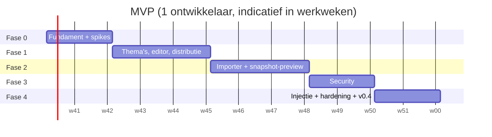

# 07 — MVP-roadmap

> Status: **ontwerp, ter goedkeuring** · Versie 0.1 · 2026-10-05

## 1. Definitie van de MVP

> **De MVP is klaar wanneer:** een ingelogde Editor een pagina van een echte app (bv. Proxmox) kan importeren, daar in de browser een thema voor schrijft met live preview en autocomplete op de classes van die app, het publiceert, en Proxmox via een gegenereerd NPM-snippet dat thema laadt vanaf `https://cssthema.domain.be/proxmox.css` — met versiegeschiedenis, rollback, import/export, Authentik-login, rollen, API-keys en audit log. Alles via `docker compose up -d`.

Bewust **na** de MVP (zie [08-productie-roadmap](08-productie-roadmap.md)): NPM-discovery in de UI, screenshot engine, AI-generatie, paletten-UI, userstyle/userscript-endpoints, Kubernetes.

Reden voor deze knip: de kern-waardeketen (importeren → schrijven → publiceren → injecteren) moet eerst bewezen werken op echte apps. Discovery, screenshots en AI versnellen het maken van thema's, maar zijn waardeloos als distributie of injectie niet betrouwbaar is. Bovendien bevat die keten de grootste technische onzekerheden (NPM `sub_filter`, CSP, Shadow DOM, snapshot-preview van SPA's) — die willen we vroeg tegenkomen.

## 2. Fasering

Indicatief totaal: **± 12 werkweken** voor één ervaren full-stack ontwikkelaar (of ± 6–7 weken met twee). De volgorde is belangrijker dan de data.

## 3. Fase 0 — Fundament en technische spikes (v0.0)

**Doel:** lege maar complete pijplijn + de drie grootste onzekerheden beantwoord vóór er feature-code komt.

| # | Taak | Resultaat / acceptatie |
|---|---|---|
| 0.1 | Monorepo-skelet volgens [06](06-repository-structuur.md), Makefile, pre-commit | `make lint test` groen op lege projecten |
| 0.2 | CI (GitHub Actions): ruff, mypy, pytest, eslint, tsc, vitest, Docker build | PR's geblokkeerd bij rood |
| 0.3 | Compose-stack: nginx, api, worker, postgres, redis met healthchecks | `docker compose up` → `/healthz` 200, SPA "hello" |
| 0.4 | FastAPI app factory, settings, structlog, Problem Details, request-ID | |
| 0.5 | SQLAlchemy base + Alembic `0001_initial` (alle MVP-tabellen) | up/down/up groen in CI |
| 0.6 | Frontend-skelet: Vite, router, shell, Tailwind/shadcn dark theme, gegenereerde API-client | |
| **S1** | **Spike NPM-injectie**: `sub_filter` + same-origin `location /__cssthema/` testen op echte NPM met Proxmox, Nextcloud, Grafana (gzip, websockets, CSP) | Werkend snippet per app, of gedocumenteerd alternatief. Bepaalt [10-theme-injectie](10-theme-injectie.md) definitief. |
| **S2** | **Spike snapshot-preview**: Playwright-capture van Proxmox (ExtJS), Immich (SvelteKit), Home Assistant (Shadow DOM); renderen in sandboxed iframe | Preview herkenbaar gelijk aan de echte pagina voor ≥ 2 van 3; bevindingen voor HA vastgelegd |
| **S3** | **Spike nginx-cache-purge**: purge per slug vs. korte TTL | Gekozen mechanisme + test |

**Go/no-go na fase 0:** als S1 voor een app niet werkt, wordt voor die app de native of userscript-methode de standaard — geen blokkade voor de MVP.

## 4. Fase 1 — Thema's, editor en distributie (v0.1)

**Doel:** zonder login (tijdelijk één dev-gebruiker) een thema kunnen maken, bewerken, publiceren en serveren.

| # | Taak | Eisen |
|---|---|---|
| 1.1 | Modellen + repositories: themes, theme_versions, palettes (alleen ingebouwde seed), users (stub) | — |
| 1.2 | CSS-domein: parser, linter incl. security-regels, compiler, minify, hash | F-ED-03, F-ED-05 |
| 1.3 | Thema-API: CRUD, draft (If-Match), lint, publish, versions, diff, rollback, duplicate, soft delete | F-TM-01..03, 06..08 |
| 1.4 | Export (`.css`, bundel) en import | F-TM-04, 05 |
| 1.5 | Publieke endpoints `/{slug}.css`, `/themes/{slug}.css`, `@{n}`, ETag/304, cache-headers, CORS, 404-gedrag | F-CD-01..05, 07, 10 |
| 1.6 | nginx: routing, microcache, `stale-if-error`, gzip/brotli, rate limit publieke CSS | F-CD-06, 08 |
| 1.7 | Editor-UI: explorer, Monaco met tabs, CSS-lint-markers, autosave met statusindicator en conflict-dialoog, publiceer-dialoog | F-ED-01, 03, 04, 10, 11 |
| 1.8 | Versies-UI met DiffEditor en rollback | F-TM-06, 07 |
| 1.9 | Thema browser (zonder thumbnails), dashboard-basis | F-TM-09, F-PL-02 |
| 1.10 | Preview-component met `bridge.js` op een **lege demo-pagina** (snapshots komen in fase 2) | F-ED-06, 08 |

**Acceptatie:** e2e-test: thema maken → CSS typen → autosave → publiceren → `curl -I /slug.css` geeft 200 + ETag → tweede request met `If-None-Match` geeft 304 → rollback → nieuwe ETag. k6: ≥ 2.000 req/s op `/slug.css`.

## 5. Fase 2 — Importer en snapshot-preview (v0.2)

**Doel:** thema's schrijven tegen de echte DOM van een app.

| # | Taak | Eisen |
|---|---|---|
| 2.1 | Services-API + UI (handmatig aanmaken, detail met tabs Overzicht/Snapshots/Selectors/Thema's) | — |
| 2.2 | Storage-abstractie (filesystem) + assets (content-addressed) | NF-04 |
| 2.3 | Jobs-tabel, arq-worker, SSE-events, jobs-UI | — |
| 2.4 | SSRF-guard (allowlist, metadata-blokkade, per-request check in Playwright) | F-SE-07 |
| 2.5 | Playwright-capture: render, Shadow DOM-serialisatie, assets downloaden, URL-herschrijving, sanitizer | F-IM-01, 03, 06 |
| 2.6 | HTML-upload (.html, .zip, .mhtml) | F-IM-02 |
| 2.7 | DOM-analyzer: classes, IDs, variabelen, kleuren, componentheuristieken, framework-hints; `snapshot_selectors` | F-IM-04, 05 |
| 2.8 | Fingerprints voor de 10 doel-apps (type-herkenning + bekende valkuilen) | F-SD-03 (deel) |
| 2.9 | Preview tegen snapshot: document-endpoint met strikte CSP, viewport-schakelaar, injectie-simulatie (head vs. shadow roots) | F-ED-07a, 08 |
| 2.10 | Monaco-autocomplete uit snapshot-selectors + palet-tokens | F-ED-02 |
| 2.11 | Lint-waarschuwing "selector matcht niet in snapshot" | F-AI-04 (hergebruik) |
| 2.12 | CLI `scripts/discover.py` voor URL-lijsten (via API, maakt services + imports) | F-SD-07 |

**Acceptatie:** voor Proxmox, Nextcloud, Grafana en Jellyfin: importeren via URL → preview is visueel herkenbaar → autocomplete toont app-classes → wijziging in editor zichtbaar in preview < 100 ms.

## 6. Fase 3 — Security (v0.3)

| # | Taak | Eisen |
|---|---|---|
| 3.1 | OIDC BFF-flow met Authentik (Authlib), sessies in Redis, CSRF double-submit | F-SE-01 |
| 3.2 | Rolmapping via groups-claim, gebruikersbeheer-UI, break-glass account | F-SE-02 |
| 3.3 | RBAC-dependency op alle endpoints + testmatrix (elke route × elke rol) | F-SE-03 |
| 3.4 | API-keys: aanmaken/intrekken, scopes, hashing, UI | F-SE-04 |
| 3.5 | Audit log: service-laag, alle schrijfacties, UI met filters en CSV-export, DB-grants append-only | F-SE-05 |
| 3.6 | Rate limiting API (Redis sliding window), headers | F-SE-06 |
| 3.7 | Versleutelde settings (Fernet) | F-SE-08 |
| 3.8 | Security headers SPA (CSP, HSTS via NPM, frame-ancestors), cookie-flags | NF-05 |
| 3.9 | Authentik-installatiehandleiding (provider, application, groups, redirect-URI) in `docs/ops/` | — |

**Acceptatie:** RBAC-testmatrix 100 % groen; ZAP baseline zonder high findings; login/logout werkt tegen echte Authentik; API-key met `themes:read` kan niet publiceren (403).

## 7. Fase 4 — Injectie, hardening en MVP-release (v0.4 = MVP)

| # | Taak | Eisen |
|---|---|---|
| 4.1 | Injectie-documentatie definitief per app ([10](10-theme-injectie.md)) op basis van spike S1 | F-IN-01 |
| 4.2 | Snippet-generator (Jinja2-templates) + tab "Injectie" in service-detail | F-IN-02 |
| 4.3 | Installatie- en upgradehandleiding, `.env.example` compleet | F-PL-01 |
| 4.4 | Basis-backupscript (pg_dump + storage-tar) + restore-instructie | F-PL-03 (basis) |
| 4.5 | Prometheus `/metrics` basis, readiness | F-PL-04 |
| 4.6 | e2e-suite volledig, performance-test, dependency-audit | NF-01, NF-06 |
| 4.7 | Release v0.4.0: multi-arch images op GHCR | NF-07 |

**Acceptatie MVP:** de definitie in § 1, gedemonstreerd op minstens Proxmox, Nextcloud, Grafana en Jellyfin in de eigen omgeving.

## 8. Implementatiestrategie

1. **Verticale slices.** Elke fase levert iets bruikbaars op; geen "backend eerst, frontend later".
2. **Contract eerst per slice.** Pydantic-schema's + route-signaturen → OpenAPI → frontend-types genereren → beide kanten parallel.
3. **Domein puur houden.** CSS- en DOM-logica als pure functies met fixture-tests; de rest is lijm.
4. **Echte fixtures.** Vanaf fase 2 worden echte pagina's van de 10 apps (geanonimiseerd) in `backend/tests/fixtures/html/` gezet met `scripts/capture_fixture.py`.
5. **Feature flags** (`settings`-tabel) voor alles wat half af is, zodat `main` releasebaar blijft.
6. **Definition of Done per taak:** tests, types, docs bijgewerkt, OpenAPI bijgewerkt, audit-acties toegevoegd waar relevant, toegankelijkheid gecontroleerd voor UI.
