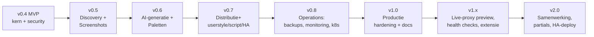

# 08 — Productie-roadmap

> Status: **goedgekeurd** · Versie 0.2 · 2026-10-05

Vertrekpunt: MVP v0.4 (zie [07-mvp-roadmap](07-mvp-roadmap.md)). Doel: **v1.0 = productieklaar** — alle hoofdfuncties uit de opdracht, betrouwbaar te beheren, met backups, monitoring en upgradepad. Daarna v1.x/v2 voor verdieping.

## 1. Overzicht

| Release | Inhoud | Indicatieve omvang |
|---|---|---|
| v0.5 | Discovery + screenshot engine | 3 weken |
| v0.6 | AI-generatie + paletten-UI | 3 weken |
| v0.7 | Afgeleide distributieformaten + injectie-test | 2 weken |
| v0.8 | Operations: backups, monitoring, Kubernetes | 2 weken |
| v1.0 | Hardening, security-review, documentatie, upgrade-test | 2 weken |

## 2. v0.5 — Service discovery en screenshot engine

| Taak | Eisen | Details |
|---|---|---|
| NPM-client + instellingen-UI (versleutelde credentials, testknop) | F-SD-01 | NPM-API: token ophalen, proxy hosts lijsten; tolerant voor NPM-versies (2.10+) |
| Discovery-jobs (NPM / URL-lijst) met kandidaten en apply-stap | F-SD-02..05, 08 | Concurrency 3, timeouts, voortgang via SSE |
| Loginpagina-detectie + favicon-ophaling | F-SD-03 | Heuristieken: password-input, bekende paden, redirect naar Authentik-domein |
| Discovery-wizard UI | — | Wireframe 3.8 |
| Screenshot-jobs (3 viewports, WebP + thumb) | F-SS-01..03 | Na elke snapshot |
| Gethemede screenshots na publicatie + voor/na-weergave | F-SS-04 | Thumbnails in thema browser |
| Retentie-job | F-SS-05 | |
| Periodieke re-crawl (cron, instelbaar) | F-SD-06 | |

**Acceptatie:** discovery op de eigen NPM vindt alle actieve hosts; ≥ 90 % krijgt correct type; screenshots voor alle drie viewports.

## 3. v0.6 — AI-generatie en paletten

| Taak | Eisen | Details |
|---|---|---|
| `AIProvider`-interface + Anthropic, OpenAI-compatibel, Ollama | F-AI-07 | Gestructureerde output (JSON-schema / tool use), timeouts, retries |
| Context builder (DOM-samenvatting, kleuren, screenshots) | F-AI-01 | Token-budget, deterministische volgorde |
| Presets + paletdefinities (Nord, Dracula, Catppuccin ×4, Gruvbox, Solarized, Material, Cyberpunk, Glassmorphism) | F-AI-02 | Glassmorphism = palet + `backdrop-filter`-overrides |
| Renderer variables + overrides → CSS; validatie (parse, lint, selector-match) | F-AI-03, 04 | |
| Palette mapping-engine (zonder AI) | F-AI-08 | Kleuren uit snapshot clusteren (OKLCH-afstand) → mappen op palet-rollen |
| AI Studio UI: meerdere presets parallel, preview-kaarten, accepteren | F-AI-05, 06 | Wireframe 3.9 |
| Kosten- en tokenregistratie, maandbudget | F-AI-09 | |
| Paletten-UI (CRUD, dupliceren, herpubliceren gekoppelde thema's) | ADR-10 | |
| Evaluatieset: 10 apps × 3 presets, handmatig gescoord (contrast, consistentie, kapotte layout) | — | Regressietest bij prompt- of modelwijziging |

**Acceptatie:** voor ≥ 7 van 10 doel-apps levert de AI een direct bruikbaar startthema (geen kapotte layout, WCAG AA-contrast op tekst); 0 externe URL's in output.

## 4. v0.7 — Uitgebreide distributie en injectie

| Taak | Eisen |
|---|---|
| `/themes/{slug}.user.css` (Stylus UserCSS met `@updateURL`, `@-moz-document domain()` uit service-URL) | F-CD-09 |
| `/themes/{slug}.user.js` (userscript, injecteert in document + open shadow roots via `adoptedStyleSheets` en MutationObserver) | F-CD-09 |
| `/themes/{slug}.ha.yaml` (Home Assistant theme: palet → HA-variabelen) | F-CD-09 |
| Injectie-test-job (link aanwezig, CSS geladen, CSP-overtredingen gedetecteerd via Playwright console) | F-IN-03 |
| Element-inspector in preview | F-ED-09 |
| Selector health check na crawl + dashboard-waarschuwing | F-TM-10 |

## 5. v0.8 — Operations

| Taak | Eisen | Details |
|---|---|---|
| Backup-container: dagelijks `pg_dump` + restic (storage), retentie 7/4/6 | F-PL-03 | Doel: lokaal pad, SFTP, S3, B2 |
| `restore.sh` + maandelijkse geautomatiseerde restore-test | F-PL-03 | Test herstelt naar tijdelijke stack en controleert `/slug.css` |
| Metrics compleet + Grafana-dashboard + voorbeeld-alerts (job-faalratio, cache hit-ratio, CSS 5xx) | F-PL-04, NF-08 | |
| OpenTelemetry (optioneel) | NF-08 | |
| S3/MinIO storage-backend | ADR-09 | |
| Kubernetes: Kustomize base + overlays, HPA, KEDA voor worker, CronJob backups | F-PL-06 | |
| Multi-replica test: 2× api, 2× worker, migratielock | NF-03 | |

## 6. v1.0 — Productie

| Taak | Details |
|---|---|
| Externe security-review / pentest-checklist (OWASP ASVS L2), fixes | Specifiek: SSRF, CSS-exfiltratie, preview-sandbox, sessie/CSRF |
| Upgrade-test: v0.4 → v1.0 met echte data | Migraties expand/contract |
| Audit-log partitionering + retentie | |
| Nederlandse vertaling UI | F-PL-05 |
| Toegankelijkheidsaudit (axe + handmatig) | NF-09 |
| Volledige documentatie: installatie, Authentik, NPM, per-app-gidsen in `docs/apps/`, troubleshooting, FAQ | |
| Load-test en resource-sizing-advies (kleine homelab vs. groot) | NF-01, NF-03 |
| SLO's gedefinieerd: CSS-beschikbaarheid 99,9 %, p95 < 20 ms | |

**Exitcriteria v1.0:** alle M- en P-eisen uit [01](01-functionele-analyse.md) geïmplementeerd en getest; geen open high/critical security-findings; restore-test 3× achter elkaar geslaagd; 30 dagen eigen gebruik zonder dataverlies of CSS-uitval.

## 7. Na v1.0

| Thema | Ideeën |
|---|---|
| **v1.1 Live-proxy preview** | Preview tegen de echte, ingelogde app via een preview-subdomein dat de app proxyt en CSS injecteert (F-ED-07b); nuttig voor dynamische schermen die een snapshot niet goed vangt. |
| **v1.2 Eigen browserextensie** | MV3-extensie op basis van `injection-map.json`, inclusief Shadow DOM-ondersteuning, voor apps waar proxy-injectie niet kan (F-IN-04). |
| **v1.3 NPM-write-integratie** | Achter feature flag: snippet automatisch in NPM advanced config zetten en terugdraaien, met diff en bevestiging. |
| **v1.4 Partials en variabelen-overerving** | Gedeelde fragmenten (F-TM-11), "globaal thema" dat in elk app-thema meegaat. |
| **v2.0 Samenwerking** | Realtime co-editing (Yjs), opmerkingen per regel, review/approve-flow vóór publiceren (4-ogen-principe voor bv. Authentik-loginpagina). |
| **v2.x Hoge beschikbaarheid** | PostgreSQL-replica (CloudNativePG), Redis Sentinel, CSS-levering via meerdere nginx-nodes of CDN-cache. |
| **Community** | Export/import van thema's tussen installaties via een (optioneel) gedeelde catalogus. |

## 8. Werkwijze per release

1. Release-plan als GitHub milestone met issues per taak (ID's uit [01](01-functionele-analyse.md)).
2. Elke release eindigt met: changelog, upgrade-notities, demo op de eigen omgeving, bijgewerkte risicoanalyse.
3. Na elke release een korte retrospectief op de risicolijst ([09](09-risicoanalyse.md)): nieuwe risico's toevoegen, gemitigeerde sluiten.
