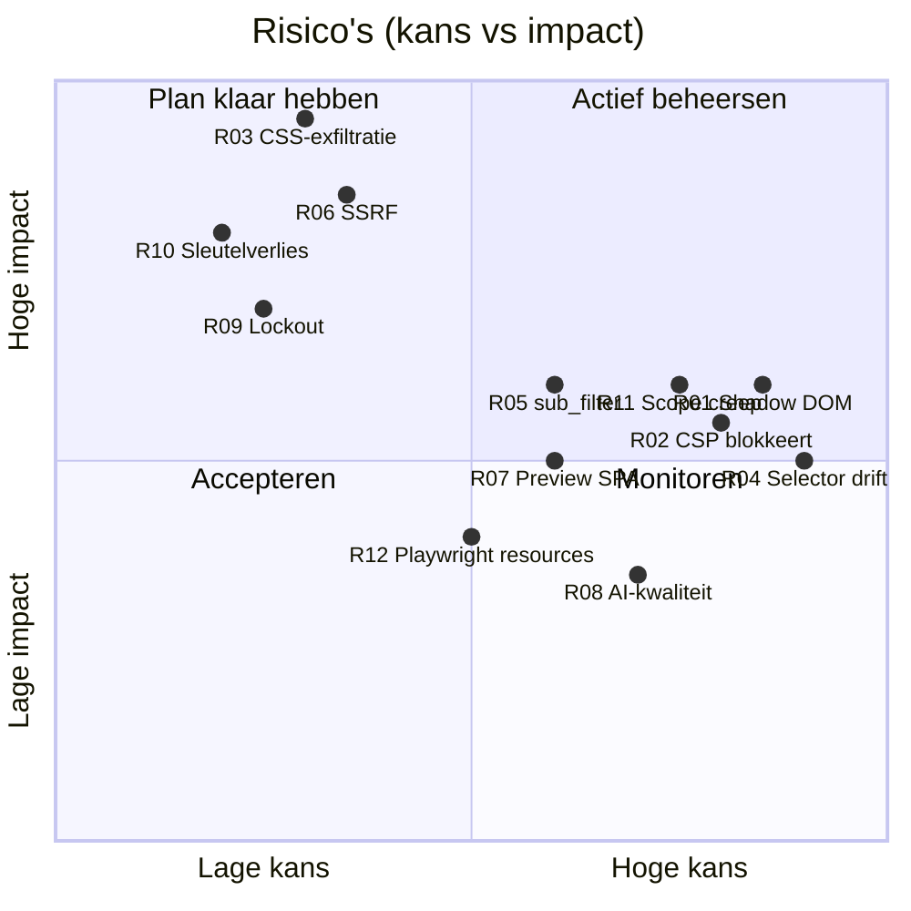

# 09 — Risicoanalyse

> Status: **goedgekeurd** · Versie 0.2 · 2026-10-05

Schaal: **K**ans en **I**mpact 1 (laag) – 5 (hoog); **Score** = K × I. ≥ 12 = hoog (rood), 6–11 = middel, ≤ 5 = laag.

## 1. Risicomatrix

## 2. Risico's

### Technisch — injectie en compatibiliteit

| ID | Risico | K | I | Score | Mitigatie | Restrisico |
|---|---|:-:|:-:|:-:|---|---|
| **R-01** | **Shadow DOM**: Home Assistant en Authentik (Lit web components) kapselen styling in; een `<link>` in `<head>` bereikt de meeste componenten niet. | 5 | 3 | **15** | (1) DOM-analyzer markeert shadow-classes expliciet; (2) per app de juiste methode: HA → theme-YAML-variabelen (`/themes/{slug}.ha.yaml`) + eventueel `card-mod`; Authentik → CSS-variabelen en zijn eigen custom-CSS-mechanisme; (3) userscript-export injecteert via `adoptedStyleSheets` in open shadow roots; (4) preview simuleert beide methodes zodat de gebruiker ziet wat werkt. | Gesloten shadow roots blijven onbereikbaar; alleen CSS-variabelen die de app zelf aanbiedt. |
| **R-02** | **Content Security Policy** van apps (Nextcloud, Authentik, mogelijk Immich) blokkeert stylesheets van een andere origin. | 4 | 3 | **12** | Standaard **same-origin injectie**: NPM `location /__cssthema/` proxyt naar cssthema, dus `<link href="/__cssthema/x.css">` valt onder `style-src 'self'`. Injectie-test (F-IN-03) detecteert CSP-blokkades via de browserconsole. | Apps met nonce-gebaseerde `style-src` zonder `'self'` — dan alleen native optie of extensie. |
| **R-04** | **Selector drift**: app-updates (Proxmox 9→10, Nextcloud majors) veranderen classes; thema's breken stil. | 5 | 3 | **15** | Periodieke re-crawl + selector health check (F-TM-10) met dashboard-waarschuwing; voorkeur voor stabiele hooks (CSS-variabelen, ARIA, `data-*`) — de linter waarschuwt bij gegenereerde/gehashte classnamen (`.css-1x2y3z`, `.svelte-abc123`); versies + rollback. | Gehashte classnamen in builds (Immich/SvelteKit, Grafana/Emotion) blijven fragiel. |
| **R-05** | **NPM `sub_filter`** werkt niet in elke situatie: gecomprimeerde upstream-responses, `location /`-overerving in NPM-templates, websockets, verschillende NPM-versies. | 3 | 4 | **12** | Spike S1 in fase 0 op echte NPM; `proxy_set_header Accept-Encoding ""` binnen de juiste location; per app getest snippet; alternatief per app gedocumenteerd (native, extensie, userscript). | NPM-updates kunnen templates wijzigen → snippets in CI testen tegen NPM-image (productiefase). |
| **R-07** | **Snapshot-preview van SPA's** wijkt af van de echte app (lazy-loaded views, canvas/WebGL bij Grafana-grafieken, ExtJS-layout via JS-berekende inline-afmetingen). | 3 | 3 | 9 | Gerenderde DOM met berekende inline-styles vastleggen; meerdere pagina's per service; later live-proxy preview (v1.1); voor/na-screenshots met echte injectie als waarheid. | Interactieve staten (hover-menu's, dialogen) moeten apart vastgelegd worden. |
| **R-13** | `sub_filter` en websockets: verkeerde snippet kan noVNC/console (Proxmox), HA-websocket of UniFi-realtime breken. | 2 | 4 | 8 | `sub_filter_types text/html` (default), `sub_filter_once on`, alleen toepassen op HTML; websocket-headers niet aanraken; snippet getest per app. | — |

### Security

| ID | Risico | K | I | Score | Mitigatie | Restrisico |
|---|---|:-:|:-:|:-:|---|---|
| **R-03** | **CSS als aanvalsvector**: een kwaadwillige of gecompromitteerde editor (of AI-output) publiceert CSS die via attribuutselectors + `url()` tekens uit wachtwoordvelden lekt op de Authentik- of Proxmox-loginpagina; of overlays die UI misleiden. | 2 | 5 | 10 | Security-lint blokkeert externe `url()`/`@import` buiten allowlist (server-side, niet omzeilbaar); AI-output gaat door dezelfde lint; RBAC: alleen Editor+ publiceert; audit log; (v2) 4-ogen-review voor thema's van gevoelige services; aanbeveling in docs: geen thema's op loginpagina's van kritieke systemen zonder review. | Visuele misleiding (overlay-tekst via `content:`) blijft mogelijk voor wie mag publiceren. |
| **R-06** | **SSRF** via importer/crawler naar interne diensten (Redis, Docker-API, router-admin, cloud metadata). | 2 | 5 | 10 | Allowlist van hosts/CIDR's, metadata/loopback/compose-services altijd geblokkeerd, controle per request (ook redirects/subresources) in Playwright, alleen Editor+, rate limit, audit. Worker in eigen netwerk zonder toegang tot `postgres`/`redis`-poorten buiten wat nodig is. | Allowlisted interne hosts zijn per definitie bereikbaar — dat is de functie. |
| **R-14** | **Kwaadaardige HTML** in uploads/snapshots (XSS in de beheer-UI). | 2 | 4 | 8 | Scripts en `on*`-attributen gestript; preview in iframe zonder `allow-same-origin` + strikte CSP als `<meta>` in de srcdoc (een responseheader bereikt srcdoc niet) en bridge inline met hash; snapshot-HTML wordt nooit in de hoofd-origin gerenderd. | — |
| **R-15** | **Gelekte API-key** of sessie. | 2 | 4 | 8 | Scopes, vervaldatums, prefix voor herkenning (gitleaks-patroon), intrekken, `last_used_at` + IP in audit, httpOnly/Secure cookies. | — |
| **R-16** | Opgeslagen **service-credentials/NPM-wachtwoord** uitgelekt bij DB-dump. | 2 | 4 | 8 | Fernet-versleuteling met key buiten de DB; aanbevolen: aparte NPM-gebruiker met alleen leesrechten; credentials optioneel. | Wie DB én `.env` heeft, heeft alles. |

### Operationeel

| ID | Risico | K | I | Score | Mitigatie |
|---|---|:-:|:-:|:-:|---|
| **R-09** | **Lockout**: Authentik onbereikbaar of misgeconfigureerd → niemand kan inloggen; of Authentik zelf wordt via cssthema gethemed en breekt. | 2 | 4 | 8 | Break-glass account (env-gestuurd); thema-uitval breekt de app nooit (CSS is additief); rollback via API-key mogelijk; Authentik-thema's extra voorzichtig (staging-slug). |
| **R-10** | **Verlies van `ENCRYPTION_KEY`/`SECRET_KEY`** → versleutelde instellingen onbruikbaar na restore. | 1 | 4 | 4 | Documentatie benadrukt aparte opslag; instellingen opnieuw invoerbaar; thema's zelf zijn niet versleuteld (geen dataverlies). |
| **R-17** | **cssthema-uitval** → apps tonen standaard-look of trage paginalaad door hangende CSS-request. | 2 | 3 | 6 | `stale-if-error` + nginx `proxy_cache_use_stale` (24 u); NPM-location met korte `proxy_connect_timeout` (1 s, spike S1) zodat een hangende backend de app niet vertraagt. |
| **R-12** | **Resourcegebruik Playwright** (RAM/CPU) op een kleine homelab-server, zeker bij discovery van 50+ services. | 3 | 2 | 6 | Aparte worker-container met limits, concurrency 3, één browser per worker, nachtelijke planning van re-crawls. |
| **R-18** | **Dataverlies** door ontbrekende/onteste backups. | 2 | 4 | 8 | Backup-container, restic naar extern doel, maandelijkse geautomatiseerde restore-test, exporteer-alles-script. |
| **R-19** | **Opslaggroei** door snapshots/screenshots. | 3 | 2 | 6 | Content-addressed assets, retentie (5 sets), WebP, metrics op storage-grootte. |

### Product en project

| ID | Risico | K | I | Score | Mitigatie |
|---|---|:-:|:-:|:-:|---|
| **R-11** | **Scope creep**: 14 hoofdfuncties, risico dat niets af raakt. | 4 | 3 | **12** | Strikte MVP-knip ([07](07-mvp-roadmap.md)), verticale slices, elke fase bruikbaar; AI en discovery bewust na de kern. |
| **R-08** | **AI-kwaliteit en kosten**: gehallucineerde selectors, onleesbaar contrast, onvoorspelbare kosten, afhankelijkheid van externe provider. | 4 | 2 | 8 | Gestructureerde output + selector-validatie + eigen CSS-renderer; contrastcheck (WCAG) op variabelen; maandbudget; lokale Ollama-optie en deterministische palette mapping als fallback; evaluatieset bij model-/promptwijziging. |
| **R-20** | **Juridisch/privacy**: snapshots bevatten mogelijk persoonlijke data (namen in Nextcloud, foto's in Immich) en worden naar een AI-provider gestuurd. | 3 | 3 | 9 | Bij voorkeur loginpagina's en lege views crawlen; optie "geen screenshots naar AI"; tekstinhoud wordt vóór AI-verzending vervangen door placeholders (alleen structuur/classes); lokale AI-optie; documentatie. |
| **R-21** | **Onderhoudslast** van per-app fingerprints, snippets en documentatie bij app-updates. | 4 | 2 | 8 | Fingerprints als kleine plug-ins met fixtures; generieke heuristiek als fallback; `docs/apps/` met "laatst geverifieerd op versie X". |

## 3. Top-5 en eigenaarschap

| Rang | Risico | Wanneer aangepakt |
|---|---|---|
| 1 | R-01 Shadow DOM | Spike S2 (fase 0), userscript/HA-export (v0.7) |
| 2 | R-04 Selector drift | Linter-waarschuwing (fase 1), health check (v0.7) |
| 3 | R-02 CSP + R-05 sub_filter | Spike S1 (fase 0) — bepaalt de standaard-injectiemethode |
| 4 | R-11 Scope creep | MVP-knip, release-reviews |
| 5 | R-03 CSS-exfiltratie | Security-lint vanaf fase 1, review-flow v2 |

## 4. Aannames die we bewust maken (en wat als ze niet kloppen)

| Aanname | Als het niet klopt |
|---|---|
| NPM `sub_filter` werkt voor de meeste apps | Standaard verschuift naar native opties + userscript/extensie; extensie (v1.2) krijgt prioriteit. |
| Snapshot-preview is "goed genoeg" voor 80 % van het werk | Live-proxy preview (v1.1) naar voren halen. |
| Eén PostgreSQL-instantie volstaat | Al ontworpen voor replica's en stateless API; geen herontwerp nodig. |
| Authentik is aanwezig | Generieke OIDC werkt met elke provider (Keycloak, Authelia, Zitadel) — alleen rolmapping-documentatie verschilt. |
