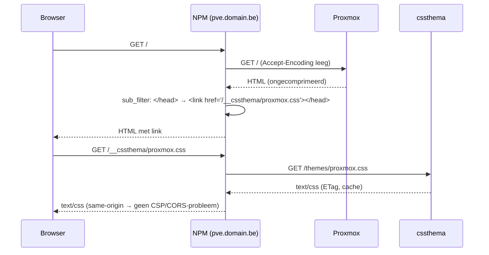

# 10 — Theme-injectie per applicatie

> Status: **ontwerp, ter goedkeuring** · Versie 0.1 · 2026-10-05
> ⚠ Alle snippets worden in **spike S1** (fase 0, zie [07](07-mvp-roadmap.md)) op een echte NPM-installatie gevalideerd. App-specifieke opties zijn gebaseerd op de huidige kennis van die apps en worden per app gemarkeerd met "laatst geverifieerd op versie X" in `docs/apps/` zodra dat getest is.

## 1. Methodes in één oogopslag

| Methode | Hoe | Werkt voor | Voordelen | Nadelen |
|---|---|---|---|---|
| **A. Reverse proxy (NPM `sub_filter`)** — *standaard* | NPM voegt `<link>` in elke HTML-response in | Alle gebruikers en apparaten, ook mobiel | Centraal, geen client-installatie | Alleen light DOM; vereist `Accept-Encoding`-truc; kan bij app-updates breken |
| **B. Native app-optie** | App heeft zelf een custom-CSS-veld of -mechanisme | Jellyfin, Nextcloud (app), Home Assistant (themes), Authentik, Uptime Kuma (statuspagina's) | Officieel ondersteund, overleeft updates | Niet elke app heeft het; soms beperkt tot variabelen |
| **C. Browserextensie (Stylus)** | UserCSS met automatische updates vanaf cssthema | Alleen jouw browser(s) | Geen serverwijziging, per gebruiker aan/uit | Per apparaat installeren; niet op mobiel (behalve Firefox Android) |
| **D. Userscript (Violentmonkey/Tampermonkey)** | Script haalt CSS op en injecteert in document **én open shadow roots** | Alleen jouw browser(s) | Enige client-methode die Shadow DOM bereikt | Per apparaat; scriptmanager nodig |
| **E. Eigen extensie** (v1.2) | Extensie leest `injection-map.json` en injecteert per hostname | Alle apps in één keer | Eén installatie voor alles | Nog te bouwen |

**Aanbevolen volgorde per app:** B als de app het netjes ondersteunt → anders A → C/D als persoonlijke aanvulling of voor Shadow DOM.

## 2. Methode A — Nginx Proxy Manager (same-origin)

### 2.1 Principe



Waarom same-origin (`/__cssthema/…` op het domein van de app zelf) in plaats van rechtstreeks `https://cssthema.domain.be/proxmox.css`:
- Een CSP met `style-src 'self'` (Nextcloud e.a.) blokkeert stylesheets van een andere origin; via dezelfde origin niet.
- Geen extra DNS/TLS-handshake naar een tweede domein.
- Bij uitval van cssthema faalt alleen dat ene request (met korte timeout), de app werkt gewoon.

### 2.2 Generiek snippet

NPM → *Hosts* → *Proxy Hosts* → host bewerken → tab *Advanced* → *Custom Nginx Configuration*:

```nginx
# --- cssthema: thema same-origin beschikbaar maken ---
location /__cssthema/ {
    # Tip: zit cssthema in hetzelfde Docker-netwerk als NPM, gebruik dan
    # proxy_pass http://cssthema-nginx:80/themes/;  (geen hairpin via DNS/TLS)
    proxy_pass https://cssthema.domain.be/themes/;
    proxy_set_header Host cssthema.domain.be;
    proxy_ssl_server_name on;
    proxy_connect_timeout 2s;
    proxy_read_timeout 5s;
    proxy_hide_header Set-Cookie;
}

# --- cssthema: <link> injecteren in HTML ---
# Een eigen "location /" vervangt de standaardlocatie van NPM;
# daarom wordt NPM's proxy-include hier zelf opgenomen.
location / {
    proxy_set_header Accept-Encoding "";          # sub_filter werkt niet op gzip
    sub_filter '</head>' '<link rel="stylesheet" href="/__cssthema/{{slug}}.css"></head>';
    sub_filter_once on;                           # sub_filter_types blijft text/html

    # websockets (noVNC, Home Assistant, UniFi, …)
    proxy_http_version 1.1;
    proxy_set_header Upgrade $http_upgrade;
    proxy_set_header Connection $http_connection;

    include conf.d/include/proxy.conf;
}
```

De snippet-generator (F-IN-02) vult `{{slug}}` en de juiste upstream in. Te valideren in spike S1:
1. dat NPM bij een `location /` in *Advanced* zijn eigen standaardlocatie weglaat (gedrag kan per NPM-versie verschillen);
2. dat de opties van de NPM-UI (*Block Common Exploits*, *Websockets Support*, *Force SSL*, access lists) correct blijven werken;
3. dat apps die `</head>` in hoofdletters of met attributen schrijven ook geraakt worden (anders `sub_filter '<head>' '<head><link …>'`).

### 2.3 Afwijkingen per app

| App | Bijzonderheid |
|---|---|
| Proxmox VE | `pveproxy` comprimeert → `Accept-Encoding ""` is noodzakelijk. noVNC/xterm-console gaat via websockets → de upgrade-headers zijn vereist. ExtJS rendert alles client-side; classes `.x-*`. |
| Grafana | Werkt met het generieke snippet. Gebruik bij voorkeur de door Grafana gezette CSS-variabelen en `data-testid`-attributen; Emotion-classnamen (`css-xxxx`) zijn niet stabiel. |
| UniFi Network | Veel realtime via websockets; generiek snippet met upgrade-headers. Self-signed upstream → `proxy_ssl_verify off` (NPM-scheme `https`). |
| Immich | SvelteKit; gehashte `svelte-xxxx`-classes vermijden, richten op Tailwind-utility-classes en structuur. Upload-endpoints niet raken (sub_filter raakt alleen HTML). |
| Portainer | Angular/React mix; generiek snippet. |
| Uptime Kuma | Dashboard via snippet; statuspagina's hebben een native custom-CSS-veld (methode B). Socket.io → upgrade-headers. |
| Nextcloud | Werkt, maar methode B heeft de voorkeur (zie § 3.2). |
| Home Assistant / Authentik | Werkt technisch, maar bereikt door Shadow DOM weinig → zie § 3. |

## 3. Per applicatie

### 3.1 Proxmox VE
- **Aanbevolen:** A (NPM `sub_filter`).
- **Native:** geen custom-CSS-optie. Het aanpassen van `/usr/share/pve-manager/index.html.tpl` op de host werkt maar wordt bij elke `pve-manager`-update overschreven → afgeraden (alleen als noodoptie gedocumenteerd).
- **Persoonlijk:** C (Stylus) of D.
- Let op: thema niet laten gelden voor de console-iframe tenzij gewenst; de console heeft eigen HTML.

### 3.2 Nextcloud
- **Aanbevolen:** B — app **"Custom CSS"** (`theming_customcss`) uit de Nextcloud App Store. In *Instellingen → Beheer → Theming → Custom CSS*:
  ```css
  @import url("/__cssthema/nextcloud.css");
  ```
  Met de same-origin location uit § 2.2 (zonder het `location /`-deel) valt dit binnen de CSP van Nextcloud. Een `@import` naar `https://cssthema.domain.be/…` wordt door de CSP geblokkeerd.
- **Alternatief:** A volledig.
- Nextcloud biedt veel CSS-variabelen (`--color-main-background`, `--color-primary-element`, …): de generator en AI richten zich daar eerst op, dat is het meest update-bestendig.

### 3.3 Immich
- **Aanbevolen:** A.
- **Native:** geen custom-CSS-instelling bekend (te verifiëren per versie).
- **Persoonlijk:** C/D. Mobiele Immich-app is native (Flutter) → CSS-thema's gelden alleen voor de webinterface.

### 3.4 Grafana
- **Aanbevolen:** A.
- **Native:** geen custom CSS; wel ingebouwde light/dark-thema's. Een eigen thema bovenop "dark" geeft het minste werk.
- **Alternatief op serverniveau:** `public/` overschrijven in de container — afgeraden (verdwijnt bij update).

### 3.5 Home Assistant
- **Aanbevolen:** B — **HA-thema's** (de officiële manier, werkt in Shadow DOM omdat het CSS-variabelen zijn):
  ```yaml
  # configuration.yaml
  frontend:
    themes: !include_dir_merge_named themes
  ```
  Download `https://cssthema.domain.be/themes/home-assistant.ha.yaml` naar `config/themes/cssthema.yaml` (cssthema genereert dit uit het palet en de variabelen van het thema; F-CD-09), herlaad thema's, kies het thema in het profiel.
- **Dieper (per kaart):** de community-integratie `card-mod` (HACS) met card-mod-thema's.
- **Volledige CSS incl. shadow roots:** `frontend: extra_module_url:` met een door cssthema gegenereerde JS-module (variant van de userscript-export, v0.7) die de stylesheet in open shadow roots adopteert. Krachtig maar fragiel bij HA-updates.
- A (`sub_filter`) bereikt alleen de light DOM → weinig effect.

### 3.6 UniFi (Network Application / UniFi OS)
- **Aanbevolen:** A of C. Geen native optie.
- Let op: UniFi OS-consoles (UDM/UCG) achter NPM zijn sowieso gevoelig (websockets, CSRF-headers); test eerst of de proxy zonder thema stabiel werkt.

### 3.7 Authentik
- **Aanbevolen:** B — Authentik laadt een eigen `custom.css` die je in de container kunt mounten (pad volgens de Authentik-documentatie van jouw versie, historisch `/web/dist/custom.css`). Inhoud:
  ```css
  @import url("/__cssthema/authentik.css");
  ```
  met de same-origin location uit § 2.2 op de Authentik-host. Controleer per versie of Authentik deze stylesheet ook in zijn web components (Shadow DOM) toepast; richt je anders op de `--pf-*`/`--ak-*`-CSS-variabelen.
- **Extra voorzichtig:** dit is de loginpagina van alles. Publiceer eerst op een test-slug (`authentik-staging`), en zie risico R-03 (CSS-exfiltratie) en R-09 (lockout).
- D (userscript) als persoonlijke aanvulling voor diepere Shadow DOM-styling.

### 3.8 Jellyfin
- **Aanbevolen:** B — *Dashboard → Algemeen → Branding → Aangepaste CSS-code*:
  ```css
  @import url("https://cssthema.domain.be/jellyfin.css");
  ```
  Jellyfin zet standaard geen strikte CSP, dus een directe URL werkt; same-origin (`/__cssthema/jellyfin.css`) mag ook. Geldt voor web- en de meeste webview-clients (Android, desktop), niet voor alle TV-apps.
- Populaire community-thema's (bv. Ultrachromic) werken op dezelfde manier, dus dit is een beproefd pad.

### 3.9 Uptime Kuma
- Statuspagina's: B — *Statuspagina bewerken → Custom CSS*: `@import url("https://cssthema.domain.be/uptime-kuma.css");`
- Dashboard: A.

### 3.10 Portainer
- **Aanbevolen:** A. Geen native optie.

## 4. Methode C — Stylus (UserCSS met automatische updates)

cssthema serveert per thema `https://cssthema.domain.be/themes/{slug}.user.css`:

```css
/* ==UserStyle==
@name         cssthema · proxmox-nord
@namespace    https://cssthema.domain.be
@version      7.0.0
@description  Beheerd door cssthema — wijzig in cssthema, niet hier
@updateURL    https://cssthema.domain.be/themes/proxmox-nord.user.css
==/UserStyle== */

@-moz-document domain("pve.domain.be") {
  /* … gecompileerde CSS van de live versie … */
}
```

Installeren: URL openen met Stylus geïnstalleerd → *Installeren*. Stylus controleert periodiek `@updateURL`; `@version` volgt het versienummer van het thema, dus elke publicatie wordt automatisch opgepikt. Het domein komt uit de `base_url` van de gekoppelde service.

## 5. Methode D — Userscript (met Shadow DOM)

`https://cssthema.domain.be/themes/{slug}.user.js` (ontwerp):

```javascript
// ==UserScript==
// @name         cssthema · home-assistant
// @namespace    https://cssthema.domain.be
// @version      4
// @match        https://ha.domain.be/*
// @run-at       document-start
// @grant        GM_xmlhttpRequest
// @connect      cssthema.domain.be
// @updateURL    https://cssthema.domain.be/themes/home-assistant.user.js
// @downloadURL  https://cssthema.domain.be/themes/home-assistant.user.js
// ==/UserScript==
(() => {
  const URL = "https://cssthema.domain.be/themes/home-assistant.css";
  const sheet = new CSSStyleSheet();
  const adopt = (root) => {
    if (!root.adoptedStyleSheets.includes(sheet)) {
      root.adoptedStyleSheets = [...root.adoptedStyleSheets, sheet];
    }
  };
  // Elke nieuwe open shadow root krijgt de stylesheet
  const origAttach = Element.prototype.attachShadow;
  Element.prototype.attachShadow = function (init) {
    const root = origAttach.call(this, init);
    if (init.mode === "open") adopt(root);
    return root;
  };
  GM_xmlhttpRequest({                // omzeilt CSP connect-src van de pagina
    url: URL + "?t=" + Date.now(),
    onload: (r) => {
      sheet.replaceSync(r.responseText);
      adopt(document);
      document.querySelectorAll("*").forEach((el) => el.shadowRoot && adopt(el.shadowRoot));
    },
  });
})();
```

Kanttekeningen (te valideren in v0.7):
- Het patchen van `attachShadow` werkt alleen in de pagina-context; bij scriptmanagers die in een geïsoleerde wereld draaien is `@inject-into page` (Violentmonkey) of `unsafeWindow` nodig.
- Een thema dat in élke shadow root geladen wordt, moet selectors gebruiken die alleen bedoelde elementen raken; de editor-preview kan deze modus simuleren.

## 6. Methode E — Eigen extensie (v1.2, vooruitblik)

- Manifest V3, `host_permissions` op de domeinen uit `injection-map.json`.
- Per tabblad: hostname → thema-URL → `chrome.scripting.insertCSS` (document) + content script voor shadow roots.
- Instelbaar: cssthema-URL + optionele API-key (voor private thema's, F-CD-11).

## 7. Cache en updates na publicatie

| Methode | Wanneer zien gebruikers een nieuwe versie? |
|---|---|
| A / B (via `/__cssthema/` of directe URL) | ≤ 60 s (max-age) + browser-revalidatie met ETag (meestal `304`, dus goedkoop) |
| C (Stylus) | Bij de volgende update-check van Stylus (standaard elke 24 u, handmatig direct) |
| D (userscript) | Bij volgende paginalaad (CSS wordt altijd opgehaald); het script zelf alleen bij `@version`-wijziging |
| HA-thema-YAML | Na opnieuw downloaden + `frontend.reload_themes` (later automatiseerbaar via de HA-API) |

## 8. Troubleshooting-checklist

1. Staat de `<link>` in de HTML? (*View source*, zoek `__cssthema`) — nee → `sub_filter` grijpt niet: compressie, verkeerde location, of `</head>`-spelling.
2. Laadt de CSS? (DevTools → Network → `proxmox.css` = 200/304, `text/css`) — 404 → slug niet gepubliceerd; 502 → upstream `cssthema` onbereikbaar vanuit NPM.
3. CSP-fout in de console? → gebruik de same-origin variant.
4. Geladen maar geen effect? → selectors matchen niet (app-update, Shadow DOM, specificiteit). Gebruik de selector health check en de element-inspector; overweeg `!important` alleen gericht.
5. App gedraagt zich vreemd na snippet (console, live updates)? → websocket-headers controleren; snippet tijdelijk verwijderen om te isoleren.

De knop **"Test injectie"** (F-IN-03) automatiseert stap 1–3.
