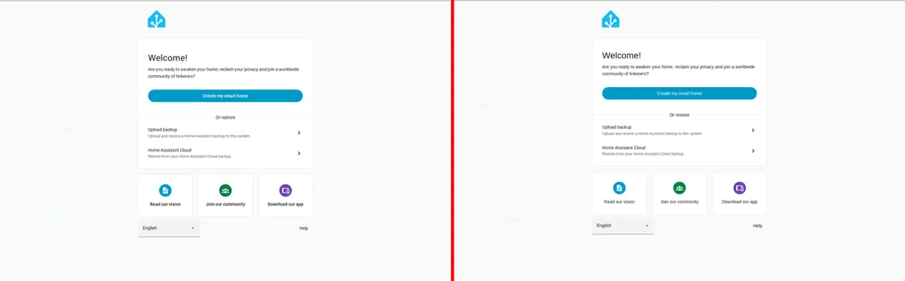
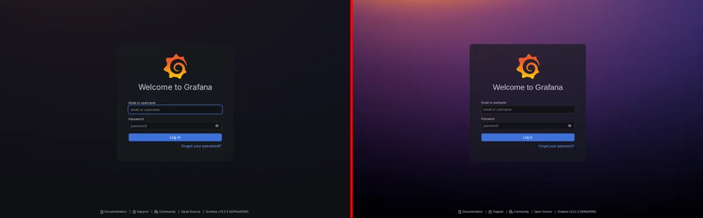
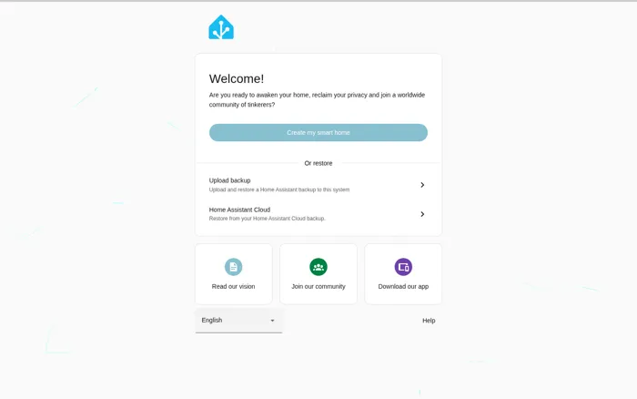

# Spike S2 — Snapshot-capture en statische preview

> Fase 0 · 2026-10-05 · Status: **aanpak bevestigd**; Proxmox (ExtJS) en Immich nog te testen in jouw omgeving

## Vraag

Kunnen we een draaiende SPA vastleggen als **statische HTML zonder JavaScript** die in de preview-iframe (`sandbox` zonder scripts, docs/02 § 4.2) herkenbaar gelijk rendert? Dat moet ook gelden met Shadow DOM, zoals bij Home Assistant.

## Aanpak (prototype: `scripts/spikes/capture_snapshot.py`)

1. Playwright/Chromium laadt de pagina (`networkidle`) en wacht daarna tot de DOM 500 ms niet meer verandert (max. 15 s).
2. Een serializer in de pagina loopt door de **gerenderde** DOM:
   - open shadow roots → declaratieve `<template shadowrootmode="open">`;
   - `adoptedStyleSheets` (Lit) → `<style>` in de juiste shadow root;
   - `<link rel=stylesheet>` en CSS-in-JS (`insertRule`) → inline `<style>` met de CSSOM-tekst, `url()` absoluut gemaakt;
   - `<canvas>` → `` (dataURL);
   - `<script>`, `<noscript>`, `on*`-attributen en `javascript:`-URL's worden verwijderd.
3. De snapshot wordt in een nieuwe context **met JavaScript uitgeschakeld** gerenderd en pixel voor pixel vergeleken met het origineel.

## Resultaten (echte containers, 1440×900)

| App | Framework | Shadow roots | Snapshot | Capture | Pixelverschil | Oordeel |
|---|---|---:|---:|---:|---:|---|
| Home Assistant (stable, onboarding) | Lit / Web Awesome | **34** | 168 KB | 1,7 s | **2,8 %** | ✓ Vrijwel identiek; kleine verschillen in lettertype-rendering |
| Uptime Kuma 1.x (setup) | Vue | 0 | 524 KB | 1,4 s | 3,8 % | ✓ |
| Grafana (latest, login) | React + Emotion | 0 | 229 KB | 2,0 s | 34 %* | ✓ Structuur identiek |
| Testpagina met geneste shadow roots | Custom elements | 4 | 2 KB | 1,0 s | 0,0 % | ✓ |

\* Het verschil bij Grafana komt door de achtergrondafbeelding van de loginpagina. Die infadet in de live pagina pas na de screenshot, terwijl de snapshot hem direct toont. Formulier, logo en tekst zijn identiek.




### Thema-effect in de snapshot (Home Assistant)

- Een globale selector (`button { background: red }`) bereikt de knoppen in de Shadow DOM **niet**. Dat is verwacht en bevestigt risico R-01.
- Een CSS-variabele op `html` (`--ha-color-primary-40`) werkt wél. De variabele erft door alle 34 shadow roots heen en de hoofdknop kleurt mee. Er is geen `!important` nodig als het thema na de stylesheets van de app komt.



Daarmee is ook de aanpak voor Home Assistant bevestigd: thema's via de variabelen van de app (HA-thema-YAML, docs/10 § 3.5), en de preview laat dat effect correct zien.

## Bevindingen die het ontwerp aanscherpen

1. **Vaste locale in de browsercontext.** Zonder `locale="en-US"` erft Chromium de container-locale (`en-US@posix`). Daarop crasht Grafana bij het opstarten (`RangeError: Invalid language tag`) en legt de capture alleen de foutpagina vast. In fase 2 wordt de locale per service instelbaar, met `en-US` als standaard.
2. **CSS-transities** (HA-knoppen hebben `transition: background-color`) vertragen het zichtbare effect in de preview met ~100–200 ms. Voor *metingen* (health checks, gethemede screenshots) zet de worker `transition: none !important` aan. In de interactieve preview laten we ze staan.
3. **CSS-in-JS** (Grafana/Emotion) bestaat alleen in de CSSOM, niet in `textContent`. De serializer moet `sheet.cssRules` lezen, en dat doet het prototype al.
4. **Assets** (fonts, afbeeldingen) wijzen in het prototype nog naar de live app. In fase 2 (taak 2.5) worden ze gedownload en herschreven naar `/api/v1/snapshots/{id}/assets/{hash}`, zodat de preview offline en zonder login werkt.
5. Een snapshot is 0,2–0,5 MB ongecomprimeerd. Gzip in storage volstaat; dit past binnen de volume-inschatting uit docs/03 § 9.

## Nog open, alleen te testen in jouw omgeving

- **Proxmox VE (ExtJS):** ExtJS berekent veel afmetingen in JavaScript en zet ze als inline style. Die gaan mee in de gerenderde DOM, dus de verwachting is goed.
- **Immich (SvelteKit)** en **Authentik (Lit)**, achter de echte login.

Het prototype draai je zo, vanuit een machine die de apps kan bereiken:

```bash
# eenmalig: Chromium voor Playwright installeren
uv run --no-project --with playwright==1.56.0 playwright install chromium
# capture + vergelijking; resultaat en screenshots in /tmp/snapshots
uv run --no-project --python 3.12 --with playwright==1.56.0 --with pillow \
  python scripts/spikes/capture_snapshot.py https://pve.domain.be/ --out /tmp/snapshots
```
